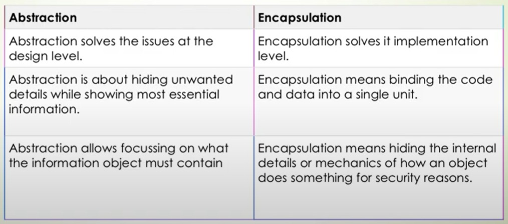
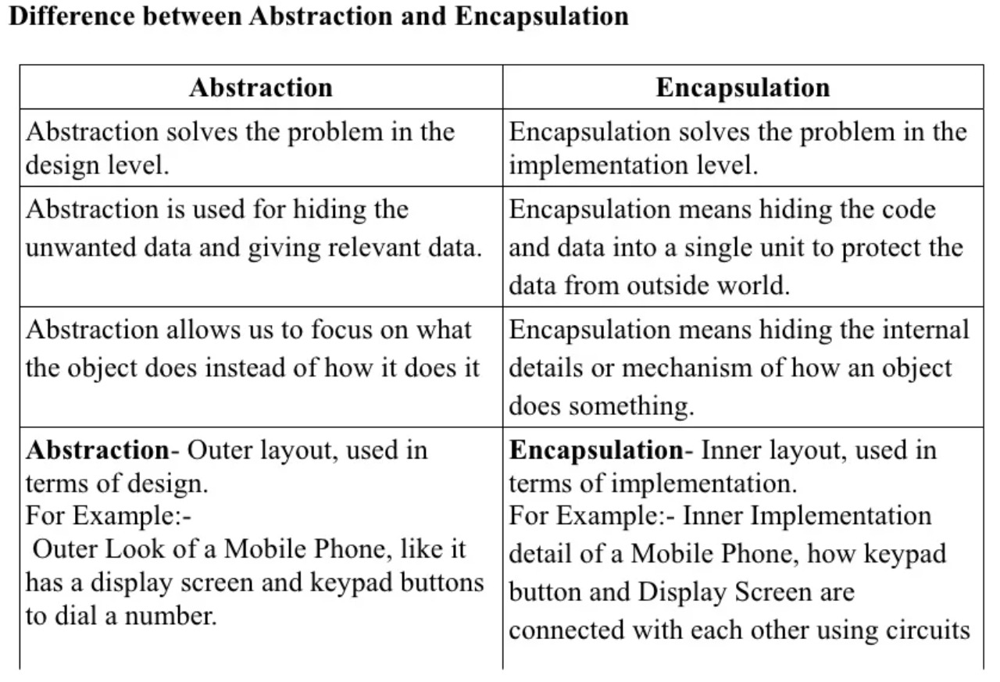

# ***`OOP`***

## Sections
1. [Abstraction](#Abstraction)
    1. [Definition](#Definition)
    1. [Abstraction Example](#example:-the-coffee-machine) 
    1. [Abstraction 2 types](#Abstraction-two-types.)

1. [Encapsulation](#Encapsulation)
    1. [difference between abstraction && encapsulation](#Difference-between-abstraction-&&-encapsulation)
1. [Inheritance](#Inheritance)
     1. [Forms of Inheritance in Object Oriented Programming](#Forms-of-Inheritance-in-Object-Oriented-Programming)
        1. [Single inheritance](#1.-Single-inheritance)
        2. [Multiple Inheritance](#2.-Multiple-Inheritance)
        3. [Multi-level](#3.-Multi-level-Inheritance)
        4. [Hierarchical inheritance](#4.-Hierarchical-inheritance)
        5. [Hybrid Inheritance](#5.-Hybrid-Inheritance)
1. [Polymorphism](#Polymorphism) 
     1. [ (2) types of polymorphism:](#2-types-of-polymorphism: )
---

# Abstraction
    - hiding unnecessary details and data from the user.
    - show what functionality available to use.

## Definition
- Its main goal is to handle complexity
    + by hiding unnecessary details and data from the user.
- focus on what functionality available to use
- That enables the user to implement more complex logic on top of the provided abstraction without understanding or even thinking about all the hidden complexity.

## example: the coffee machine
- You need to know how to use your coffee machine to make coffee. 
- You need to provide 1-water and 2-coffee beans, switch it on and 3-select the kind of coffee you want to get.

- The thing you don’t need to know is how the coffee machine is working internally.

## Abstraction two types.
source: https://www.journaldev.com/33191/what-is-abstraction-in-oops

1. Data Abstraction (private data)
2. Process Abstraction (private methods)

---
---

# Encapsulation
    - bundling(wrapping) data and methods that work on that data within a single unit

---
## Difference between abstraction && encapsulation

--- 
--- 

# Inheritance
    - It is a mechanism where you can to derive a class from another class for a hierarchy of classes 
    - that share a set of attributes and methods.

## Forms of Inheritance in Object Oriented Programming
 source: https://www.guru99.com/java-class-inheritance.html

|type |Definition  |  |
|--- |---  |---  |
| 1. Single inheritance  | This is a form of inheritance in which a class inherits only one parent class |  |
| 2. Multiple Inheritance | An inheritance becomes multiple inheritances when a class inherits more than one parent class. ""NOt Exist In dart""  |  |
| 3. Multi-level | For example, a class_1 is inherited by a class_2 and this class_2 also gets inherited by class_3 and this process goes on. This is known as multi-level inheritance. |  |
| 4. Hierarchical inheritance | In this, various Child classes inherit a single Parent class. The example given in the introduction of the inheritance is an example of Hierarchical inheritance since classes BMW and Audi inherit class Car. |  |
| 5. Hybrid Inheritance | When there is a combination of more than one form of inheritance, it is known as hybrid inheritance. |  |

 ---
 ---
 # Polymorphism
     - Many Form >> perform a single action in different ways
     - it occurs when we have many classes that are related to each other by inheritance.
     - Polymorphism is the ability of an object to take on many forms. 
     - it describes the concept that you can access objects of different types through the same interface. 
     - Each type can provide its own independent implementation of this interface.

## 2 types of polymorphism:
1. static or compile-time
2. dynamic

    ### `Static`: 
     - can determine which method will run in the compiling time
     - do the same operation in same class
     - Overload
     - NO overloading in dart

    ### `Dynamic`: 
     - can determine which method will run in the run time
     - same operation in different classes
     - Override
