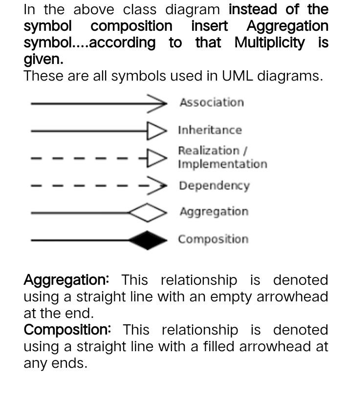
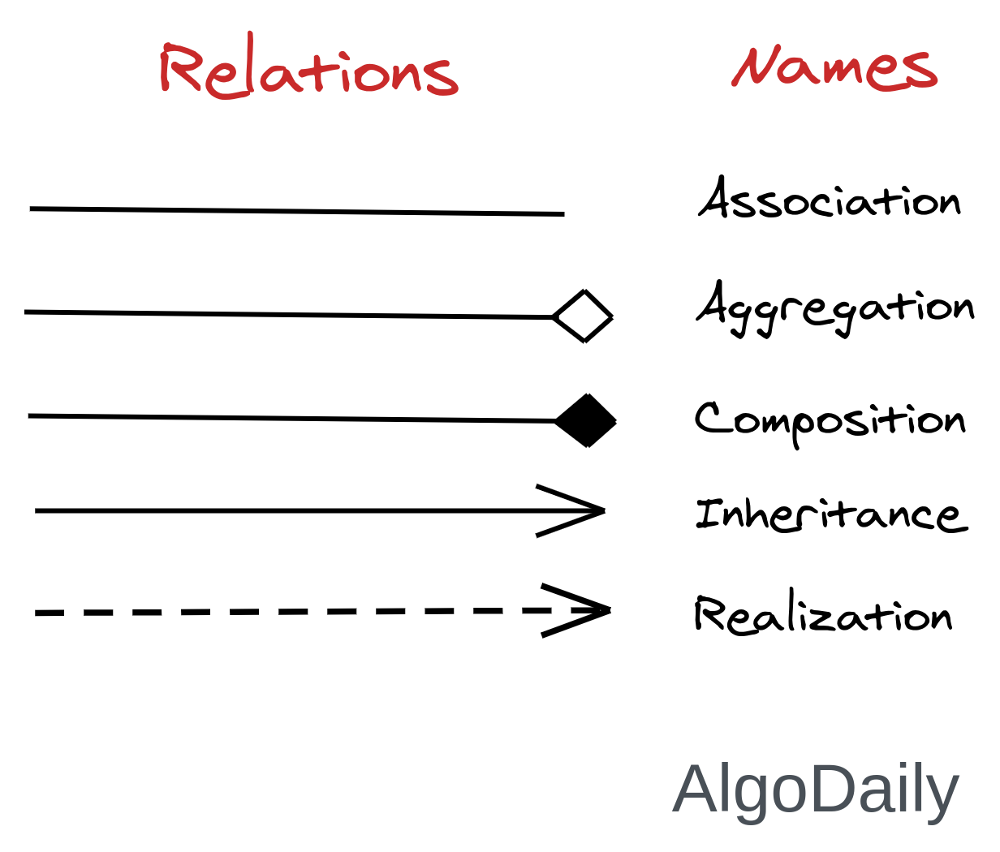
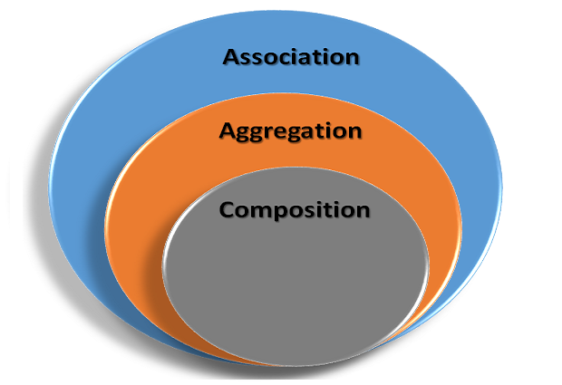
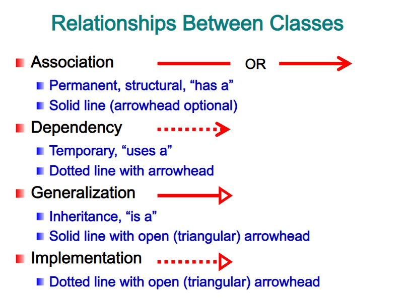
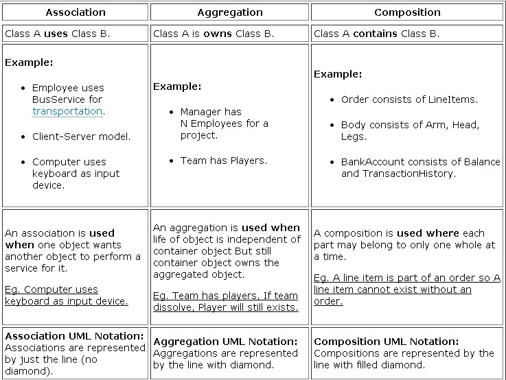
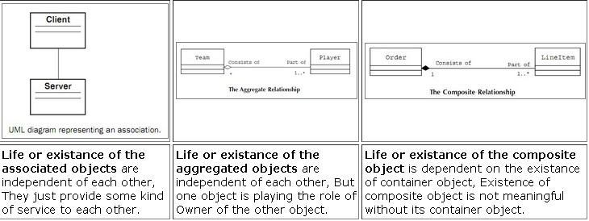
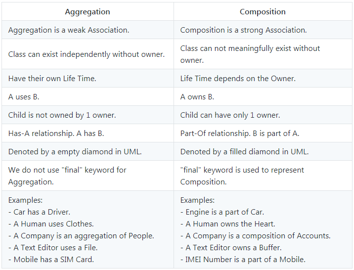
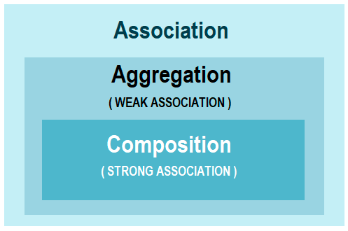

# OOP Relationships
In UML there are five different types of relationships:

**Association** , **Aggregation** , **Composition** , **dependency** , and **inheritance**.

## Sections
1. [Symbols](#Symbols)
1. [Association](#Association)
    - [Types](#Types)
1. [Aggregation](#Aggregation)
1. [Composition](#Composition) 
1. [Comparison](#Comparison) 
1. [Example](#Example) 
1. [Extra](#Extra) 

# Symbols
| | |
|--- |--- |
|||
|||  

---
# Association
- an Object communicates to another object to use functionality and services provided by that object.
- Association is defined as the relationship between objects.
- when one object has one or more references to other objects.
- the relationship among the objects determines what an object instance can cause another to perform an action on its behalf. 

Association:
 - I have a relationship with an object.
 - Foo uses Bar

        class Foo {         
            Bar bar;
        };
NB: See Fowler's definition - the key is that Bar is semantically related to Foo rather than just a dependency **(like an int or string)**.

## Types 
`uni-directional` association:
- only one of the classes is aware of the relationship.

-     class printer{
            print(String  value)
        }
        class Teacher{
            printExam(Printer printer)=> printer.print("");
        }

`bi-directional` association:
- both classes know about each other and with
- 
- 
        class Student{
            List<Teacher> teachers;
            assignATempTeacher(Teacher teacher){
                teacher.assignAHomeWork(homeWork);
            }
        }
        class Teacher{
            List<Student> students;
            assignExamToStudent(Student student,Exam exam){
              student.setExam(exam);  
            } 
        }

--- 
# Aggregation
 - is a weak type of association
 - one-way relationship that specifies a 'has-a' relationship between two classes.

## example:
 - you can say that a wallet has money.
 - However, the money does not need a wallet in order to exist, so the relationship is one-way.

## Aggregation:
- I have an object which I've borrowed from someone else.
- When Foo dies, Bar may live on.
- 
- 
        class Foo { 
            Bar bar; 
            Foo(Bar bar) { 
            this.bar = bar; 
            }
        }
 
 ---
 # Composition
- is a stricter (strong type) form of association.
- also called death relationship.
- It defines a one-way relationship that specifies an 'is-part-of' relationship between two classes.
- This type of relationship controls the life cycle of the owned object in a way that if the owner is destroyed then the owned object is destroyed too.

## example:
 - you can say that a room is part of a house.
 - The rooms cannot exist outside of the house. In a town planning simulation, if you deleted a house object, the rooms would also be deleted.

## Composition:
  - I own an object and I am responsible for its lifetime.
  - When Foo dies, so does Bar.
  - 
- 
        class Foo {
            // Must be final 
            final Bar bar = Bar(); 
        }

---
# Comparison

| | | |
|--- |--- |-- |
| Association | I have a relationship with an object. |Foo uses Bar |
| Composition | I own an object and I am responsible for its lifetime. | When Foo dies, so does Bar | 
| Aggregation | I have an object which I've borrowed from someone else. | When Foo dies, Bar may live on. |

---
---

|context |Aggregation |Composition |
|--- |--- |-- |
|Life time  |objects have their own lifetime and there is no owner|	controlled by whole or parent that owns it|
|Scope |parent objects and child objects are independent |parent object also means the death of its children.|
|Relationship |Has-a |Part-of |
|Strength |weak relationship |strong relationship.|
|example | Car and Driver |Car and wheels |

# Example
- example 1: https://www.scaler.com/topics/association-composition-and-aggregation-in-java/

- example 2: 
    - Example of Composition

            //Car must have Engine
            class Car {
            //engine is a mandatory part of the car
            final Engine engine;
                Car () {
                    engine = Engine();
                }
            }

            //Engine Object
            class Engine {}

    - Example of Aggregation

            //Team
            class Team {      
            //players can be 0 or more
            List players;

            Team () {
                players = ArrayList();
            }
            }
            //Player Object
            class Player {}

# Extra

- <strong style="display:block;margin:12px 0 4px"><a href="https://www.javaguides.net/2018/08/coupling-in-java-with-example.html" title="Coupling" target="_blank">Coupling</a></strong>

- <strong style="display:block;margin:12px 0 4px"><a href="https://www.baeldung.com/java-composition-aggregation-association" title="composition-aggregation-association" target="_blank">composition-aggregation-association</a></strong>

- <strong style="display:block;margin:12px 0 4px"><a href="https://stackoverflow.com/questions/63758893/implementing-a-bidirectional-association-relationship-in-python" title="Implementing a bidirectional association relationship in Python" target="_blank">Implementing a bidirectional association relationship in Python</a></strong>

- <strong style="display:block;margin:12px 0 4px"><a href="https://refactoring.guru/change-bidirectional-association-to-unidirectional" title="Change Bidirectional Association to Unidirectional" target="_blank">Change Bidirectional Association to Unidirectional</a></strong>

- 
 <strong style="display:block;margin:12px 0 4px"><a href="https://slideplayer.com/slide/5119872/" title="CMSC 132: Object-Oriented Programming II" target="_blank">CMSC 132: Object-Oriented Programming II</a></strong><iframe src="https://player.slideplayer.com/16/5119872/" width="664" height="547" frameborder="0" marginwidth="0" marginheight="0" scrolling="no" style="border:1px solid #CCC;border-width:1px 1px 0" allowfullscreen></iframe>

