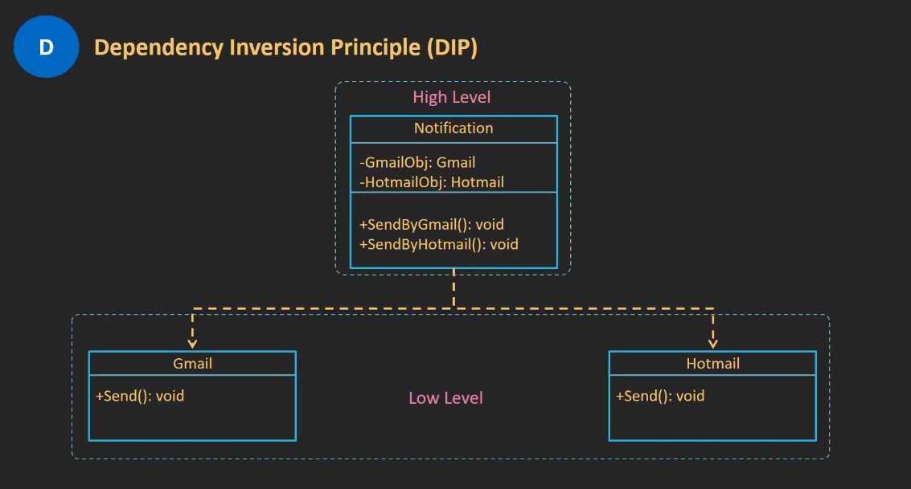
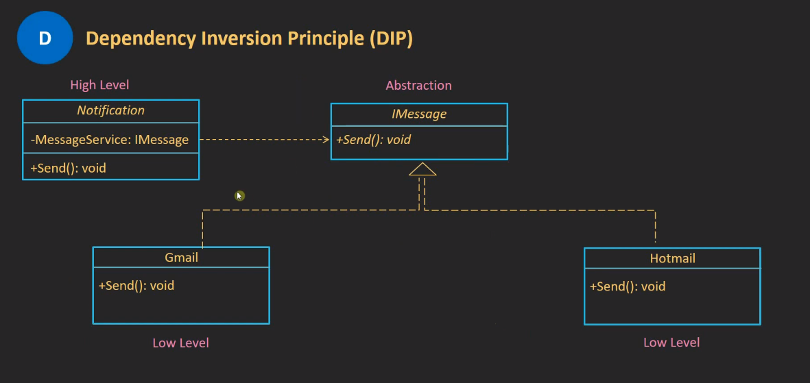
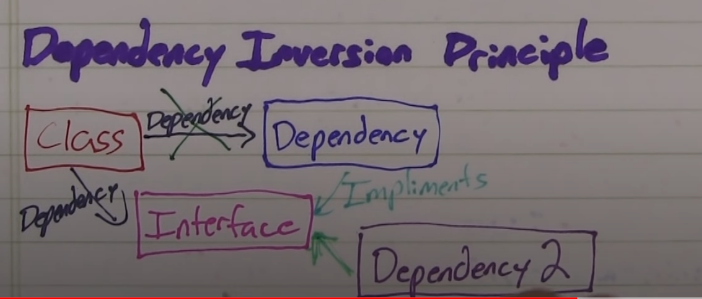

# **_`Solid Principles`_**

1. [1. Single Responsibility Principle (SRP)](<#1.-Single-Responsibility-Principle-(SRP)>)
1. [2. Open closed principle](#2.-Open-closed-principle)
1. [3. Liskov Substitution Principle (LSP)](<#3.-Liskov-Substitution-Principle-(LSP)>)
1. [4. Interface Segregation Principle (ISP)](<#4.-Interface-Segregation-Principle-(ISP)>)
1. [5. Dependency Inversion Principle (DIP)](<#5.-Dependency-Inversion-Principle-(DIP)>)

## 1. Single Responsibility Principle (SRP)

- a class should only have a single responsibility
- so that it could change for one reason and no more.
- In other words,
  - you should create classes dealing with a single duty
  - so that they’re easier to maintain and harder to break.

### ❌ Wrong

```dart
class Shapes {
    List<String> cache = List<>();
    // Calculations
    double squareArea(double l) { /* ... */ }
    double circleArea(double r) { /* ... */ }
    double triangleArea(double b, double h) { /* ... */ }
    // Paint to the screen
    void paintSquare(Canvas c) { /* ... */ }
    void paintCircle(Canvas c) { /* ... */ }
    void paintTriangle(Canvas c) { /* ... */ }
    // GET requests
    String wikiArticle(String figure) { /* ... */ }
    void _cacheElements(String text) { /* ... */ }
}
```

### ✅ Right

- class for each operation or logic

```dart
// Calculations and logic
abstract class Shape {
    double area();
}
class Square extends Shape {}
class Circle extends Shape {}
class Rectangle extends Shape {}
// UI painting
class ShapePainter {}
// Networking
class ShapesOnline {}
```

- There are 3 separated classes focusing on a single task to accomplish:

  they are easier to read, test, maintain and understand.

---

---

## 2. Open closed principle

- in a good architecture
  - you should be able to add new behaviors
  - without modifying the existing source code.
- This concept is notoriously described with the sentence:
  > **"software entities should be open for extensions but closed for modifications "**.

### ❌ Wrong

```dart
/// SRP class
class Rectangle {
    final double width;
    final double height;
    Rectangle(this.width, this.height);
}

/// SRP class
class Circle {
    final double radius;
    Rectangle(this.radius);
    double get PI => 3.1415;
}

/// problem is here
class AreaCalculator {
    double calculate(Object shape) {
        if (shape is Rectangle) {
            // Smart cast
            return r.width * r.height;
        } else {
            final c = shape as Circle;
            return c.radius * c.radius * c.PI;
        }
    }
}
```

- Both Rectangle and Circle respect the SRP
- The problem is inside AreaCalculator:
  - because if we added other shapes,
  - we would have to edit the code to **add more if conditions**

### ✅ Right

- replaced if => with interface
- open for extensions >> open to add new shape
- close for modification >> no written class or method will modified

```dart
// Use it as an interface
abstract class Area {
    double computeArea();
}
// Every class calculates the area by itself
class Rectangle implements Area {}
class Circle implements Area {}
class Triangle implements Area {}
class Rhombus implements Area {}
class Trapezoid implements Area {}
class AreaCalculator {
    double calculate(Area shape) {
    return shape.computeArea();
    }
}

```

- Thanks to the **interface**,
- now we have the possibility to add or remove as many classes as we want
- without changing AreaCalculator.

  - For example, if we added class Square implements Area it would automatically be "compatible" with the double calculate(...) method.

  - Ÿ The gist of this principle is: depend on abstractions and not on implementations.
  - Thanks to abstract classes you work with abstractions and not with the concrete implementations: your code doesn’t rely on "predefined" entities.

---

---

## 3. Liskov Substitution Principle (LSP)

- that **`subclasses should be replaceable with superclasses`**

  - without altering the logical correctness of the program.

- In practical terms, it means that a
  - subtype must guarantee the "usage conditions" of its supertype
  - plus something more it wants

### ❌ Wrong

```dart
class Rectangle {
    double width;
    double height;
    Rectangle(this.width, this.height);
}
class Square extends Rectangle {
    Square(double length): super(length, length);
}

/// Fail >>> Not Valid change width and height with different values of square
void main() {
    Rectangle fail = Square(3);
    fail.width = 4;
    fail.height = 8;
}
```

- We have a big logic problem here.
  - A square must have 4 sides with the same length
  - but the rectangle doesn’t have this restriction.
- at this point we have a square with 2 sides of length 4 and 2 sides of length 8
  ... which is absolutely wrong!

- This example also shows that:
  - inheriting from **abstract classes or interfaces**,
  - rather than **concrete classes**,
  - is a very good practice. Prefer composition (with interfaces) over inheritance.

### ✅ Right

- to solve this problem,
  - `simply make Rectangle and Square two independent classes`.
  - Breaking LSP does not occur if you depend from interfaces:
  - they don’t provide any logic implementation as it’s deferred to the actual classes.

```dart
abstract class Shape {
    double computeArea();
}
class Rectangle implements Shape {}
class Square extends Shape {}
```

---

## 4. Interface Segregation Principle (ISP)

- A client doesn’t have to be forced to implement a behavior it doesn’t need.
- What turns out from this is:
  - you should create small interfaces with minimal methods.
  - Generally `it’s better having 8 interfaces with 1 method instead of 1 interface with 8 methods`.

### ❌ Wrong

```dart
// Interfaces
abstract class Worker {
  void work();
  void sleep();
}
class Human implements Worker {
  void work() => print("I do a lot of work");
  void sleep() => print("I need 10 hours per night...");
}
class Robot implements Worker {
  void work() => print("I always work");
  void sleep() {} // ??
}

```

### ✅ Right

This is definitely better because

- there are no useless methods
- and we’re free to decide which behaviors should the classes implement.

```dart
// Interfaces
abstract class Worker {
  void work();
}
abstract class Sleeper {
  void sleep();
}
class Human implements Worker, Sleeper {
  void work() => print("I do a lot of work");
  void sleep() => print("I need 10 hours per night...");
}
class Robot implements Worker {
  void work() => print("I always work");
}
```

---

## 5. Dependency Inversion Principle (DIP)

`very important`

- DIP states that we should code against abstractions and not implementations.

  - ✅ Extending an abstract class is good
  - ✅ and implement an interface is good

- ❌ but descending from a concrete classed with no abstract methods is bad.


<table align="center">
    <tr>
      <td> ❌ Wrong </td>
      <td> ✅ Right </td>
    </tr>
    <tr>
      <td></td>
      <td></td>
    </tr>
    <tr>
      <td>
       <p>in the high level (notification class) I created 2 objects of the 2 classes hotMail and gmail</p>
      </td>
      <td>
        <p>hotMail and gmail Implemented the IMessage interface so then in the high level (Notification class) I declared an object from the IMessage Interface</p>
      </td>
    </tr>
</table>



client = dependency = the thing that we injected (gmail and hotMail)

### ❌ Wrong

```dart
/// Low Level
class HotMail {
  send() {}
}

class Gmail {
  send() {}
}

/// high level
class Notification {
  HotMail hotMail = HotMail();
  Gmail gmail = Gmail();

  void sendGmail() => gmail.send();
  void sendHotMail() => hotMail.send();
}

/// in Main
void main(List<String> args) {
  Notification notification = Notification();
  notification.sendGmail();
  notification.sendHotMail();
}

```

### ✅ Right

```dart

/// Low Level
abstract class BaseMail {
  send();
}

class HotMail implements BaseMail {
  @override
  send() {}
}

class Gmail implements BaseMail {
  @override
  send() {}
}

/// high level
class Notification {
  BaseMail baseMail;

  Notification(this.baseMail);

  void send() => baseMail.send();
}

/// in Main
void main(List<String> args) {
  Notification notification = Notification(Gmail());
  notification.send();
}
```

---

- Dependency injection (DI) is a very famous way to implement the DIP.
- Depending on abstractions gives the freedom to be independent from the implementation.
- Look at this example:

```dart
// Use this as interface
abstract class EncryptionAlgorithm {
String encrypt(); // <-- abstraction
}
class AlgoAES implements EncryptionAlgorithm {}
class AlgoRSA implements EncryptionAlgorithm {}
class AlgoSHA implements EncryptionAlgorithm {}

class FileManager {
  void secureFile(EncryptionAlgorithm algo) {
    algo.encrypt();
  }
}
```

- The `FileManager class` knows nothing about how algo works, it’s just aware that the encrypt() => Method secures a file.

- This is essential for maintenance because we can call the method as we want:

```dart
void main(){
  final fm = FileManager(...);
  fm.secureFile(AlgoAES());
  fm.secureFile(AlgoRSA());
}
```

If we added another encryption algorithm, it would be automatically compatible with secureFile
as it is a subtype of EncryptionAlgorithm.

**In this example, Done the 5 SOLID principles all together.**
