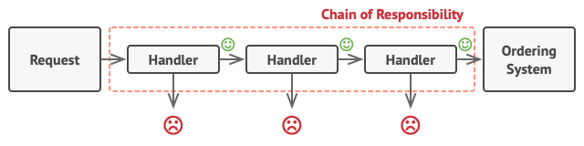
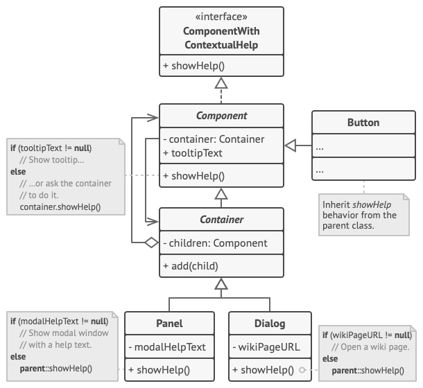
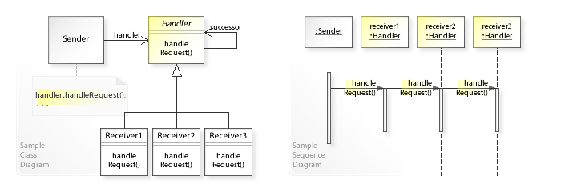

<div id="top"></div>

# Chain Of Responsibility

 > GOF: 
 > - Avoid coupling the sender of a request to its receiver by giving more than one object a chance to handle the request.
 > - Chain the receiving objects and pass the request along the chain until an object handles it.

image source: https://refactoring.guru/design-patterns/chain-of-responsibility

<p align="center"><table>
    <tr>
    <td>
    
    </td>
    <td>
    
    </td>
    </tr>
    <tr>
    <td>
    
    </td>
    <td>
    
    </td>
    </tr>
</p></table>
 
    

<details>
  <summary> <h2 style="display: inline;">  Sections</h2> </summary>

- [Definitions](#Definitions)
- [What problems can it solve](#What-problems-can-it-solve)
- [What solution does it describe](#What-solution-does-it-describe)
- [Examples](#Examples)
    - [Logger Example](#Logger-Example)
    - [Processor Example](#Processor-Example)
- [Sources](#Sources)
</details>


## Definitions

- <details>
  <summary> <h3 style="display: inline;">refactoring.guru</h3> </summary>

  - Chain of Responsibility is a behavioral design pattern.
  - that lets you pass requests along a chain of handlers. Upon receiving a request,
  - each handler decides either to process the request or to pass it to the next handler in the chain.
  </details>


- <details>
  <summary> <h3 style="display: inline;">  Tutorial Point</h3> </summary>

  - behavioral patterns.
  - creates a chain of receiver objects for a request.
  - This pattern decouples sender and receiver of a request based on type of request.
    >-  In this pattern, normally each receiver contains reference to another receiver.
    >- If one object cannot handle the request then it passes the same to the next receiver and so on.
  </details>
   


- <details>
  <summary> <h3 style="display: inline;">  Wikipedia</h3> </summary>
  
    - is a behavioral design pattern consisting of a source of command objects and a series of processing objects.
    - Each processing object contains logic that defines the types of command objects that it can handle; 
    - the rest are passed to the next processing object in the chain.
    - A mechanism also exists for adding new processing objects to the end of this chain.

    - In a variation of the standard chain-of-responsibility model, some handlers may act as `dispatchers`, `capable of sending` commands out in a variety of directions, forming a tree of responsibility.
        - In some cases, this can occur recursively, with processing objects calling higher-up processing objects with commands that attempt to solve some smaller part of the problem; in this case recursion continues until the command is processed, or the entire tree has been explored. An XML interpreter might work in this manner.

    > This pattern promotes the idea of loose coupling.

    >- The chain-of-responsibility pattern is structurally nearly identical to the decorator pattern,
    >-  the difference being that 
    >- decorator:: all classes handle the request, 
    >- chain of responsibility:: exactly one of the classes in the chain handles the request.
    >> This is a strict definition of the Responsibility concept in the GoF book.
    >> However, many implementations (such as loggers below, or UI event handling, or servlet filters in Java, etc) allow several elements in the chain to take responsibility.

 </details>
    


## What problems can it solve

### wikipedia
1. Coupling the sender of a request to its receiver should be avoided.
2. It should be possible that more than one receiver can handle a request.

 <details>
    <summary> <h3 style="display: inline;">refactoring.guru</h3> </summary>

- Imagine that you’re working on an online ordering system.
    1.  You want to restrict access to the system so only authenticated users can create orders. 
    2. Also, users who have administrative permissions must have full access to all orders.

> After a bit of planning, you realized that these checks must be performed sequentially. The application can attempt to authenticate a user to the system whenever it receives a request that contains the user’s credentials. However, if those credentials aren’t correct and authentication fails, there’s no reason to proceed with any other checks.

- During the next few months, you implemented several more of those sequential checks.

    1. One of your colleagues suggested that it’s unsafe to pass raw data straight to the ordering system. So you added an extra validation step to sanitize the data in a request.

    2. Later, somebody noticed that the system is vulnerable to brute force password cracking. To negate this, you promptly added a check that filters repeated failed requests coming from the same IP address.

    3. Someone else suggested that you could speed up the system by returning cached results on repeated requests containing the same data. Hence, you added another check which lets the request pass through to the system only if there’s no suitable cached response.

    >> With each new check the code became bigger, messier, and uglier..The bigger the code grew, the messier it became.


</details>


## What solution does it describe
<!-- wikipedia -->
-  <details>
    <summary> <h3 style="display: inline;">wikipedia</h3> </summary>

    -  depending on run-time conditions:
    > - to either handle a request 
    > - or forward it to the next receiver on the chain (if any).
    - This enables us to send a request to a chain of receivers without having to know which one handles the request.
    - The request gets passed along the chain until a receiver handles the request. The sender of a request is no longer coupled to a particular receiver.

    </details>

### the UML class and sequence diagram below.

<p align="center" ></p>


## Examples 

### Logger Example 
Source: https://github.com/scottt2/design-patterns-in-dart/tree/master/chain_of_responsibility

> - A logger is created using a chain of loggers,
> - each one configured with different log levels.

- In this pattern,
- normally each receiver contains reference to another receiver.
- If one object cannot handle the request
- then it passes the same to the next receiver and so on.

- Implementation
  1.  We have created an abstract class AbstractLogger with a level of logging.
  1.  Then we have created three types of loggers extending the AbstractLogger.
  1.  Each logger checks the level of message to its level and print accordingly
  1.  otherwise does not print and pass the message to its next logger.

#### Step 1
> Create an abstract logger class.

```dart
enum LogLevel {
  None,
  Info,
  Debug,
  Warning,
  Error,
  FunctionalMessage,
  FunctionalError
}

abstract class Logger {
  final Set<LogLevel> levels;
  Logger? _next;

  Logger(this.levels);

  bool get universal => levels.containsAll(LogLevel.values);
  void set next(Logger nextLogger) => _next = nextLogger;
  // void addLevel(LogLevel level) => levels.add(level);

  void log(LogLevel level, String msg) {
    // will do 2 things first check if this logger contains the specific level
    // if true it will write the message and then go to next
    // if else it will to next
    if (levels.contains(level) || universal) {
      write_message(msg);
    }
    _next?.log(level, msg);
  }

  void write_message(String msg);
}
```
#### Step 2
> Create concrete classes extending the logger.

```dart
class ConsoleLogger extends Logger {
  ConsoleLogger(Set<LogLevel> levels) : super(levels);
  void write_message(String msg) => print("[Console]: $msg");
}

class EmailLogger extends Logger {
  EmailLogger(Set<LogLevel> levels) : super(levels);
  void write_message(String msg) => print("[Email]: $msg");
}

class FileLogger extends Logger {
  FileLogger(Set<LogLevel> levels) : super(levels);
  void write_message(String msg) => print("[File]: $msg");
}
```
#### Step 3
>- Create different types of loggers.
>- Assign them error levels and set next logger in each logger.
>- Next logger in each logger represents the part of the chain.

```dart
void main() {
  Logger logger = ConsoleLogger(Set.from(LogLevel.values));
  Logger eLog = EmailLogger(
      Set.from([LogLevel.FunctionalMessage, LogLevel.FunctionalError]));
  Logger fLog = FileLogger(Set.from([LogLevel.Warning, LogLevel.Error]));

  logger.next = eLog;
  eLog.next = fLog;

  logger.log(LogLevel.Debug, "Some amazingly helpful debug message");
  logger.log(LogLevel.Info, "Pretty important information");

  logger.log(LogLevel.Warning, "This is a warning!");
  logger.log(LogLevel.Error, "AHHHHHHHHH!");

  logger.log(LogLevel.FunctionalError, "This is not a show stopper");
  logger.log(LogLevel.FunctionalMessage, "This is basically just info");

  /*
    [Console]: Some amazingly helpful debug message
    [Console]: Pretty important information
    [Console]: This is a warning!
    [File]: This is a warning!
    [Console]: AHHHHHHHHH!
    [File]: AHHHHHHHHH!
    [Console]: This is not a show stopper
    [Email]: This is not a show stopper
    [Console]: This is basically just info
    [Email]: This is basically just info
  */
}

```
### Processor Example
  Example: <a href="chain_example/" target="_blank"> click here </a>
## Summery
-  Intention: Avoid coupling the sender of a request to its receiver by giving more than one object a chance to handle the request.
- Chain the receiving objects and pass the request along the chain until an object handles it.

## Sources
- https://github.com/scottt2/design-patterns-in-dart/tree/master/chain_of_responsibility

- GOF Book
- https://en.wikipedia.org/wiki/Chain-of-responsibility_pattern#C#_example
- https://refactoring.guru/design-patterns/chain-of-responsibility
- https://www.tutorialspoint.com/design_pattern/chain_of_responsibility_pattern.htm

<p align="right">(<a href="#top">back to top</a>)</p>