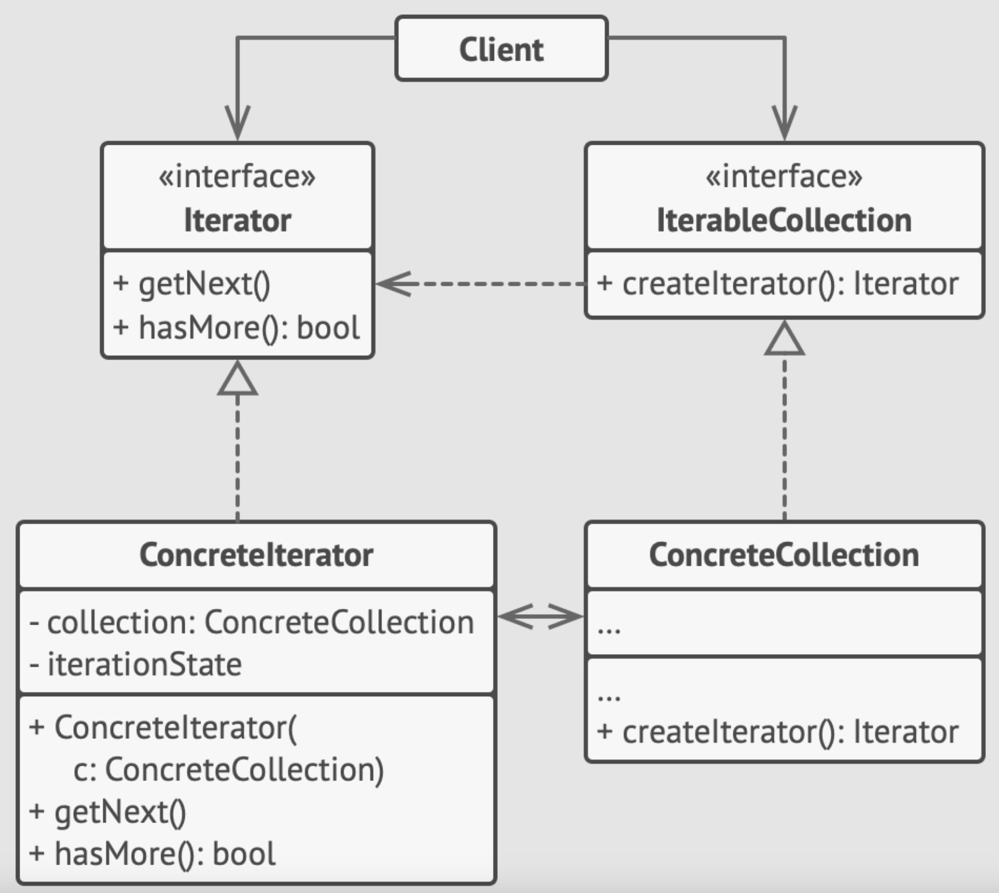

<div id="top"></div>

# Iterator Design Pattern

- A behavioral design pattern:
  - lets you (traverse elements || get a way to access the elements) of a collection without know its underlying representation (list, stack, tree, etc.).
 
- Identification: 
  - Iterator is easy to recognize by the navigation methods (such as next, previous and others).
  - Client code that uses iterators might not have direct access to the collection being traversed.

<details>
  <summary> <h2 style="display: inline;"> Sections </h2> </summary>

- [Iterator Design Pattern](#iterator-design-pattern)
  - [Definitions](#definitions)
  - [Components \&\& Diagrams (UML class || Sequence diagrams).](#components--diagrams-uml-class--sequence-diagrams)
    - [Components By Guru](#components-by-guru)
      - [1. The Iterator interface:](#1-the-iterator-interface)
      - [2. Concrete Iterators implement:](#2-concrete-iterators-implement)
      - [3. The Collection (Container || Aggregation) interface:](#3-the-collection-container--aggregation-interface)
      - [4. Concrete Collections:](#4-concrete-collections)
      - [5. The Client:](#5-the-client)
    - [Components By geeksforgeeks](#components-by-geeksforgeeks)
      - [1. Iterator Interface/Abstract Class](#1-iterator-interfaceabstract-class)
    - [2. Concrete Iterator](#2-concrete-iterator)
    - [3. Aggregate Interface/Abstract Class](#3-aggregate-interfaceabstract-class)
    - [4. Concrete Aggregate](#4-concrete-aggregate)
  - [What problems can it solve || When to Use || Use Cases](#what-problems-can-it-solve--when-to-use--use-cases)
    - [Geeks: The Design Pattern can be useful in various scenarios, such as:](#geeks-the-design-pattern-can-be-useful-in-various-scenarios-such-as)
    - [GURU](#guru)
  - [Examples](#examples)
    - [Operations with context Example](#operations-with-context-example)
    - [Social Example \[Hard\]](#social-example-hard)
  - [When to **not** use Iterator Design Pattern](#when-to-not-use-iterator-design-pattern)
  - [Summery](#summery)
  - [Sources](#sources)
</details>


## Definitions

- <details>
  <summary> <h3 style="display: inline;"> Tutorial Point </h3> </summary>

  - Used to get a way to access the elements of a collection object in sequential manner without any need to know its underlying representation.

  </details>

- <details>
  <summary> <h3 style="display: inline;"> geeksforgeeks.org </h3> </summary>

  - The Iterator pattern:
    - is a widely used design pattern in software development
    - that provides a way to access the elements of an aggregate object (such as a list or collection) sequentially without exposing its underlying representation

  ----

  - It defines a separate object, called an iterator, 
    - which encapsulates the details of traversing the elements of the aggregate, 
    - allowing the aggregate to change its internal structure without affecting the way its elements are accessed.

  </details>


- <details>
  <summary> <h3 style="display: inline;"> refactoring.guru </h3> </summary>

  `Iterator is a behavioral design pattern`
  - that allows sequential traversal through a complex data structure without exposing its internal details.

  </details>


## Components && Diagrams (UML class || Sequence diagrams).

### Components By Guru



#### 1. The Iterator interface:
  - declares the operations required for traversing a collection: 
    - fetching the next element, 
    - retrieving the current position, 
    - restarting iteration, etc.

#### 2. Concrete Iterators implement:
  - specific algorithms for traversing a collection.
  - The iterator object should track the traversal progress on its own.
  - This allows several iterators to traverse the same collection independently of each other.

#### 3. The Collection (Container || Aggregation) interface:
  - declares one or multiple methods for getting iterators compatible with the collection.
  - Note that:
    - the return type of the methods must be declared as the iterator interface so that the concrete collections can return various kinds of iterators.

#### 4. Concrete Collections:
  - return new instances of a particular concrete iterator class each time the client requests one.
  - You might be wondering, where’s the rest of the collection’s code? Don’t worry, it should be in the same class.
  - It’s just that these details aren’t crucial to the actual pattern, so we’re omitting them.

#### 5. The Client:
  - Works with both collections and iterators via their interfaces.
    - This way the client isn’t coupled to concrete classes,
    - allowing you to use various collections and iterators with the same client code.
  
  - clients don’t create iterators on their own,
    - but instead get them from collections.
    - Yet, in certain cases, the client can create one directly; for example, when the client defines its own special iterator.


### Components By geeksforgeeks

#### 1. Iterator Interface/Abstract Class
- Defines the interface for accessing and traversing elements in the collection.
- It typically includes methods like `hasNext()`, `next()`, and optionally `remove()`.

### 2. Concrete Iterator
- Implements the Iterator interface and maintains the current position in the traversal of the aggregate.
- It provides the actual implementation for the traversal operations defined in the Iterator interface.


### 3. Aggregate Interface/Abstract Class
- Defines the interface for creating an Iterator object. 
- It typically includes a method like `createIterator()` that returns an Iterator object for the collection.

### 4. Concrete Aggregate
- Implements the Aggregate interface and represents the collection of objects.
- It provides the implementation for creating an Iterator object that can traverse its elements.

## What problems can it solve || When to Use || Use Cases

- The Iterator pattern:
  - Allows us to access the elements of a collection sequentially without exposing its underlying representation.
  - It provides a way to iterate over a collection regardless of its internal structure.


### Geeks: The Design Pattern can be useful in various scenarios, such as: 

- **Need for sequential access**:
  - Use the Iterator pattern:  
    - when you need to access elements of a collection sequentially without exposing its underlying representation.

- **Decoupling iteration logic**: 
  - Use the Iterator pattern: 
    - when you want to decouple the iteration logic from the collection. 
    - This allows the collection to change its internal structure without affecting the way its elements are accessed.

- **Support for multiple iterators**: 
  - Use the Iterator pattern:
    - when you need to support multiple iterators over the same collection.
    - Each iterator maintains its own iteration state, allowing multiple iterations to occur concurrently.

- **Simplifying client code**: 
  - Use the Iterator pattern: to simplify client code that iterates over a collection.
  - Clients only need to interact with the iterator interface, abstracting away the complexity of the collection’s internal structure.

### GURU 
  - Use the Iterator pattern when your collection has a complex data structure under the hood, but you want to hide its complexity from clients (either for convenience or security reasons).

  - Use the pattern to reduce duplication of the traversal code across your app.

  - Use the Iterator when you want your code to be able to traverse different data structures or when types of these structures are unknown beforehand.

## Examples 

### Operations with context Example 
Source: [link](https://www.geeksforgeeks.org/iterator-pattern/)
Dart Code: [link](salary_example.dart)


```dart

// Employee class
class Employee {
  final String _name;
  final double _salary;

  Employee(this._name, this._salary);

  double getSalary() => _salary;
  String getName() => _name;
}

/// Iterator interface
abstract interface class Iterator<T> {
  bool hasNext();
  T next();
}

/// Aggregate interface
abstract interface class Aggregate<T> {
  Iterator<T> createIterator();
}

/// Concrete Iterator
class EmployeeIterator implements Iterator<Employee> {
  int _currentIndex = 0;
  final List<Employee> _employees;

  EmployeeIterator(List<Employee> employees) : _employees = employees;

  @override
  bool hasNext() {
    return _currentIndex < _employees.length;
  }

  @override
  Employee next() {
    if (!hasNext()) {
      throw Exception("No such element");
    }
    return _employees[_currentIndex++];
  }
}

// Concrete Aggregate
class Company implements Aggregate<Employee> {
  final List<Employee> _employees;

  Company(List<Employee> employees) : _employees = employees;

  @override
  Iterator<Employee> createIterator() {
    return EmployeeIterator(_employees);
  }
}

void main() {
  List<Employee> employees = [];
  employees.add(Employee("Alice", 50000));
  employees.add(Employee("Bob", 60000));
  employees.add(Employee("Charlie", 70000));

  Company company = Company(employees);
  Iterator<Employee> iterator = company.createIterator();

  double totalSalary = 0;
  while (iterator.hasNext()) {
    totalSalary += iterator.next().getSalary();
  }

  print("Total salary: $totalSalary");
}

/// Total salary: 180000.0

```

### Social Example [Hard]

- Source: [refactoring.guru java example](https://refactoring.guru/design-patterns/iterator/java/example)
- Dart Code: [link](social_example.dart)


## When to **not** use Iterator Design Pattern

1. **When the collection is not accessed sequentially**: If the collection is not accessed sequentially, using the Iterator pattern may add unnecessary complexity.
2. **When the collection structure is fixed**: If the structure of the collection is fixed and unlikely to change, using the Iterator pattern may be overkill. Direct access methods may be more appropriate and simpler to implement.
3. **When performance is critical**: In performance-critical applications, the overhead of using iterators may be significant, especially if the collection is large. In such cases, consider direct access methods for better performance.
4. **When the language provides better alternatives**: Some languages provide built-in constructs or libraries that offer more efficient ways to iterate over collections.


## Summery


- The main idea of the Iterator pattern is to extract the traversal behavior of a collection into a separate object called an `iterator`.


## Sources

- https://www.geeksforgeeks.org/iterator-pattern/
- https://refactoring.guru/design-patterns/iterator
- https://www.tutorialspoint.com/design_pattern/iterator_pattern.htm


<p align="right">(<a href="#top">back to top</a>)</p>