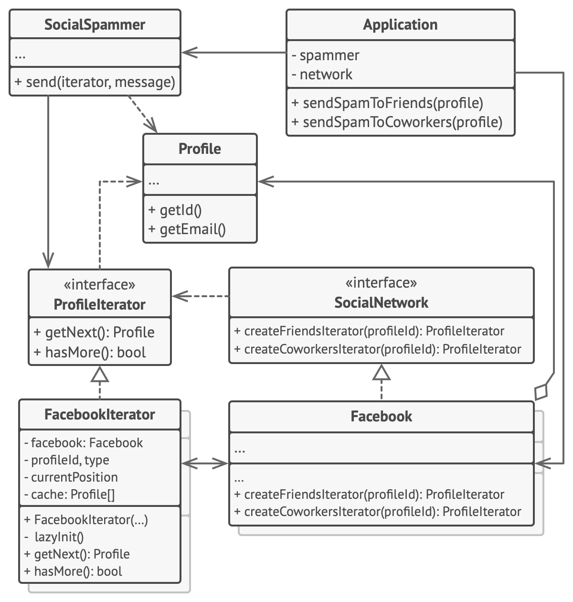

# Iterating over social network profiles

## In this example,
- the Iterator pattern is used to go over social profiles of a remote social network collection without exposing any of the communication details to the client code.
- which encapsulates access to Facebook’s social graph.
- The collection provides several iterators that can traverse profiles in various ways.

## Structure of the Iterator pattern example



- The ‘friends’ iterator can be used to go over the friends of a given profile.
- The ‘colleagues’ iterator does the same, except it omits friends who don’t work at the same company as a target person.
- Both iterators implement a common interface which allows clients to fetch profiles without diving into implementation details such as authentication and sending REST requests.

- The client code isn’t coupled to concrete classes because it works with collections and iterators only through interfaces.
- If you decide to connect your app to a new social network, you simply need to provide new collection and iterator classes without changing the existing code.


```dart
import 'dart:io';

/// Iterators
/// Defines profile interface
abstract interface class ProfileIterator {
  bool hasNext();
  Profile? getNext();
  void reset();
}

/// Implements iteration
///
/// Implements iteration over Facebook profiles
class FacebookIterator implements ProfileIterator {
  final Facebook _facebook;
  final String _type;
  final String _email;
  int _currentPosition = 0;
  final List<String> _emails = [];
  final List<Profile?> _profiles = [];

  FacebookIterator(Facebook facebook, String type, String email)
      : _facebook = facebook,
        _type = type,
        _email = email;

  void _lazyLoad() {
    if (_emails.isEmpty) {
      List<String> profiles = _facebook.requestProfileFriendsFromFacebook(
        _email,
        _type,
      );
      for (String profile in profiles) {
        _emails.add(profile);
        _profiles.add(null);
      }
    }
  }

  @override
  bool hasNext() {
    _lazyLoad();
    return _currentPosition < _emails.length;
  }

  @override
  Profile? getNext() {
    if (!hasNext()) {
      return null;
    }

    String friendEmail = _emails[_currentPosition];
    Profile? friendProfile = _profiles[_currentPosition];
    if (friendProfile == null) {
      friendProfile = _facebook.requestProfileFromFacebook(friendEmail);
      _profiles[_currentPosition] = friendProfile;
    }
    _currentPosition++;
    return friendProfile;
  }

  @override
  void reset() {
    _currentPosition = 0;
  }
}

/// Implements iteration
/// Implements iteration over LinkedIn profiles
class LinkedInIterator implements ProfileIterator {
  final LinkedIn _linkedIn;
  final String _type;
  final String _email;
  int _currentPosition = 0;
  final List<String> _emails = [];
  final List<Profile?> _contacts = [];

  LinkedInIterator(LinkedIn linkedIn, String type, String email)
      : _linkedIn = linkedIn,
        _type = type,
        _email = email;

  void _lazyLoad() {
    if (_emails.isEmpty) {
      List<String> profiles =
          _linkedIn.requestRelatedContactsFromLinkedInAPI(_email, _type);
      for (String profile in profiles) {
        _emails.add(profile);
        _contacts.add(null);
      }
    }
  }

  @override
  bool hasNext() {
    _lazyLoad();
    return _currentPosition < _emails.length;
  }

  @override
  Profile? getNext() {
    if (!hasNext()) {
      return null;
    }

    String friendEmail = _emails[_currentPosition];
    Profile? friendContact = _contacts[_currentPosition];
    if (friendContact == null) {
      friendContact = _linkedIn.requestContactInfoFromLinkedInAPI(friendEmail);
      _contacts[_currentPosition] = friendContact;
    }
    _currentPosition++;
    return friendContact;
  }

  @override
  void reset() {
    _currentPosition = 0;
  }
}

/// Social Networks [Collection]
/// 
/// Defines common social network interface
/// The collection interface must declare a factory method for
/// producing iterators. You can declare several methods if there
/// are different kinds of iteration available in your program.

abstract interface class SocialNetwork {
  ProfileIterator createFriendsIterator(String profileEmail);
  ProfileIterator createCoworkersIterator(String profileEmail);
}

/// Facebook
class Facebook implements SocialNetwork {
  late List<Profile> _profiles;

  Facebook(List<Profile>? cache) {
    if (cache != null) {
      _profiles = cache;
    } else {
      _profiles = [];
    }
  }

  Profile? requestProfileFromFacebook(String profileEmail) {
    // Here would be a POST request to one of the Facebook API endpoints.
    // Instead, we emulates long network connection, which you would expect
    // in the real life...
    _simulateNetworkLatency();
    print("Facebook: Loading profile '$profileEmail' over the network...");

    // ...and return test data.
    return _findProfile(profileEmail);
  }

  List<String> requestProfileFriendsFromFacebook(
      String profileEmail, String contactType) {
    // Here would be a POST request to one of the Facebook API endpoints.
    // Instead, we emulates long network connection, which you would expect
    // in the real life...
    _simulateNetworkLatency();
    print(
        "Facebook: Loading '$contactType' list of '$profileEmail' over the network...");

    // ...and return test data.
    Profile? profile = _findProfile(profileEmail);
    if (profile != null) {
      return profile.getContacts(contactType);
    }
    return [];
  }

  Profile? _findProfile(String profileEmail) {
    for (Profile profile in _profiles) {
      if (profile.getEmail().contains(profileEmail)) {
        return profile;
      }
    }
    return null;
  }

  void _simulateNetworkLatency() async {
    try {
      await Future.delayed(Duration(milliseconds: 2500));
    } catch (e) {
      print(e);
    }
  }

  @override
  ProfileIterator createFriendsIterator(String profileEmail) {
    return FacebookIterator(this, "friends", profileEmail);
  }

  @override
  ProfileIterator createCoworkersIterator(String profileEmail) {
    return FacebookIterator(this, "coworkers", profileEmail);
  }
}

/// LinkedIn
class LinkedIn implements SocialNetwork {
  late List<Profile> _contacts;

  LinkedIn(List<Profile>? cache) {
    if (cache != null) {
      _contacts = cache;
    } else {
      _contacts = [];
    }
  }

  Profile? requestContactInfoFromLinkedInAPI(String profileEmail) {
    // Here would be a POST request to one of the LinkedIn API endpoints.
    // Instead, we emulates long network connection, which you would expect
    // in the real life...
    _simulateNetworkLatency();
    print("LinkedIn: Loading profile '$profileEmail' over the network...");

    // ...and return test data.
    return _findContact(profileEmail);
  }

  List<String> requestRelatedContactsFromLinkedInAPI(
      String profileEmail, String contactType) {
    // Here would be a POST request to one of the LinkedIn API endpoints.
    // Instead, we emulates long network connection, which you would expect
    // in the real life.
    _simulateNetworkLatency();
    print(
      "LinkedIn: Loading '$contactType' list of '$profileEmail' over the network...",
    );

    // ...and return test data.
    Profile? profile = _findContact(profileEmail);
    if (profile != null) {
      return profile.getContacts(contactType);
    }
    return [];
  }

  Profile? _findContact(String profileEmail) {
    for (Profile profile in _contacts) {
      if (profile.getEmail().contains(profileEmail)) {
        return profile;
      }
    }
    return null;
  }

  void _simulateNetworkLatency() async {
    try {
      await Future.delayed(Duration(milliseconds: 2500));
    } catch (e) {
      print(e);
    }
  }

  @override
  ProfileIterator createFriendsIterator(String profileEmail) {
    return LinkedInIterator(this, "friends", profileEmail);
  }

  @override
  ProfileIterator createCoworkersIterator(String profileEmail) {
    return LinkedInIterator(this, "coworkers", profileEmail);
  }
}

/// profile
/// Social profiles
class Profile {
  late String _name;
  late String _email;
  final Map<String, List<String>> _contacts = {};

  Profile(String email, String name, List<String> contacts) {
    _email = email;
    _name = name;

    // Parse contact list from a set of "friend:email@gmail.com" pairs.
    for (String contact in contacts) {
      List<String> parts = contact.split(":");
      String contactType = "friend";
      String contactEmail;
      if (parts.length == 1) {
        contactEmail = parts[0];
      } else {
        contactType = parts[0];
        contactEmail = parts[1];
      }
      if (!contacts.contains(contactType)) {
        _contacts[contactType] = [];
      }
      _contacts[contactType]?.add(contactEmail);
    }
  }

  String getEmail() {
    return _email;
  }

  String getName() {
    return _name;
  }

  List<String> getContacts(String contactType) {
    if (!_contacts.containsKey(contactType)) {
      _contacts[contactType] = [];
    }
    return _contacts[contactType] ?? [];
  }
}

/// spammer
/// Message sending app

class SocialSpammer {
  SocialNetwork network;
  ProfileIterator? iterator;
  SocialSpammer(this.network);

  void sendSpamToFriends(String profileEmail, String message) {
    print("\nIterating over friends...\n");
    iterator = network.createFriendsIterator(profileEmail);
    while (iterator!.hasNext()) {
      Profile? profile = iterator!.getNext();
      sendMessage(profile?.getEmail(), message);
    }
  }

  void sendSpamToCoworkers(String profileEmail, String message) {
    print("\nIterating over coworkers...\n");
    iterator = network.createCoworkersIterator(profileEmail);
    while (iterator!.hasNext()) {
      Profile? profile = iterator!.getNext();
      sendMessage(profile?.getEmail(), message);
    }
  }

  void sendMessage(String? email, String message) {
    print("Sent message to: '$email'. Message body: '$message'");
  }
}

/// Client code
/// Everything comes together here.

void main() {
  print(
    "Please specify social network to target spam tool (default:Facebook):",
  );
  print("1. Facebook");
  print("2. LinkedIn");
  final String choice = stdin.readLineSync()?.toLowerCase().trim() ?? "";

  SocialNetwork network;
  if (choice.contains("2")) {
    network = LinkedIn(createTestProfiles());
  } else {
    network = Facebook(createTestProfiles());
  }

  SocialSpammer spammer = SocialSpammer(network);
  spammer.sendSpamToFriends(
    "anna.smith@bing.com",
    "Hey! This is Anna's friend Josh. Can you do me a favor and like this post [link]?",
  );
  spammer.sendSpamToCoworkers(
    "anna.smith@bing.com",
    "Hey! This is Anna's boss Jason. Anna told me you would be interested in [link].",
  );
}

List<Profile> createTestProfiles() {
  List<Profile> data = [];
  data.add(Profile("anna.smith@bing.com", "Anna Smith", [
    "friends:mad_max@ya.com",
    "friends:catwoman@yahoo.com",
    "coworkers:sam@amazon.com"
  ]));
  data.add(Profile("mad_max@ya.com", "Maximilian",
      ["friends:anna.smith@bing.com", "coworkers:sam@amazon.com"]));
  data.add(
      Profile("bill@microsoft.eu", "Billie", ["coworkers:avanger@ukr.net"]));
  data.add(
      Profile("avanger@ukr.net", "John Day", ["coworkers:bill@microsoft.eu"]));
  data.add(Profile("sam@amazon.com", "Sam Kitting", [
    "coworkers:anna.smith@bing.com",
    "coworkers:mad_max@ya.com",
    "friends:catwoman@yahoo.com"
  ]));
  data.add(Profile("catwoman@yahoo.com", "Liza",
      ["friends:anna.smith@bing.com", "friends:sam@amazon.com"]));
  return data;
}

/// Execution result
/// Please specify social network to target spam tool (default:Facebook):
/// 1. Facebook
/// 2. LinkedIn

// Iterating over friends...

// Facebook: Loading 'friends' list of 'anna.smith@bing.com' over the network...
// Facebook: Loading profile 'mad_max@ya.com' over the network...
// Sent message to: 'mad_max@ya.com'. Message body: 'Hey! This is Anna's friend Josh. Can you do me a favor and like this post [link]?'
// Facebook: Loading profile 'catwoman@yahoo.com' over the network...
// Sent message to: 'catwoman@yahoo.com'. Message body: 'Hey! This is Anna's friend Josh. Can you do me a favor and like this post [link]?'

// Iterating over coworkers...

// Facebook: Loading 'coworkers' list of 'anna.smith@bing.com' over the network...
// Facebook: Loading profile 'sam@amazon.com' over the network...
// Sent message to: 'sam@amazon.com'. Message body: 'Hey! This is Anna's boss Jason. Anna told me you would be interested in [link].'
```