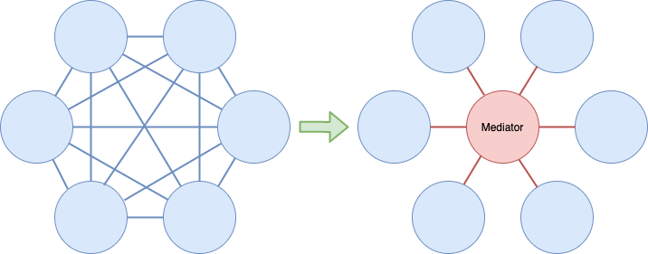
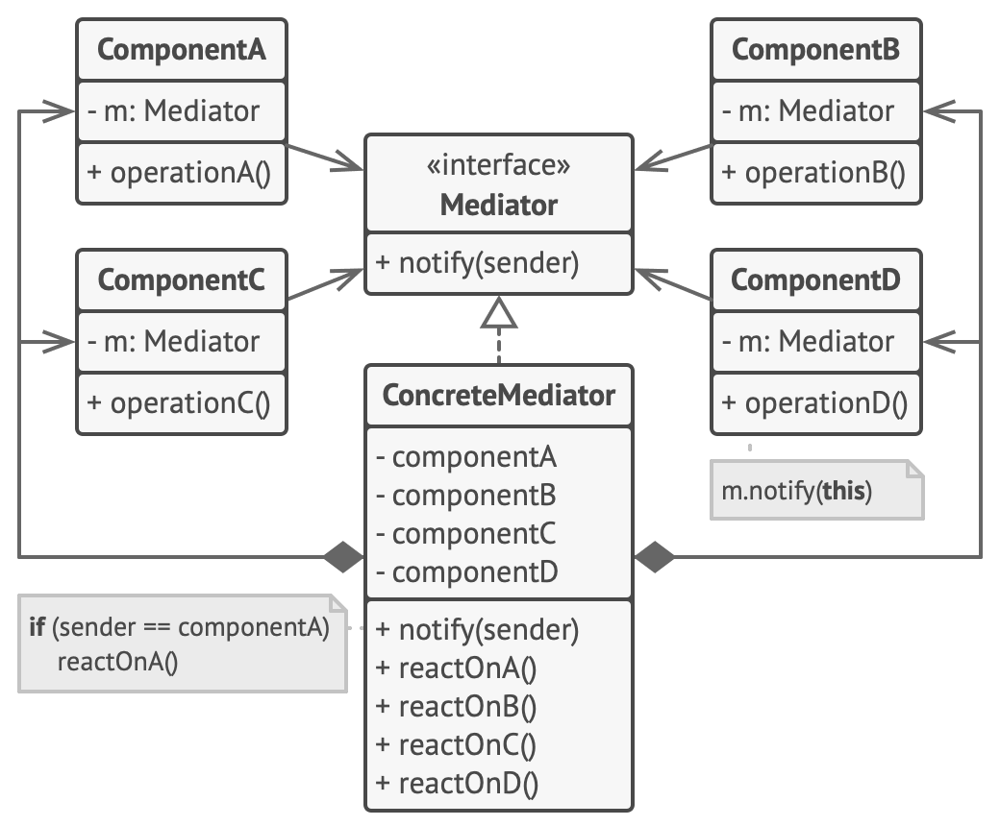
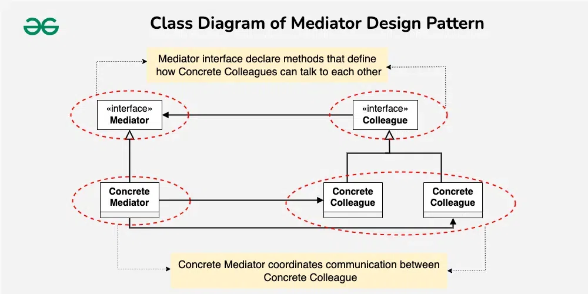
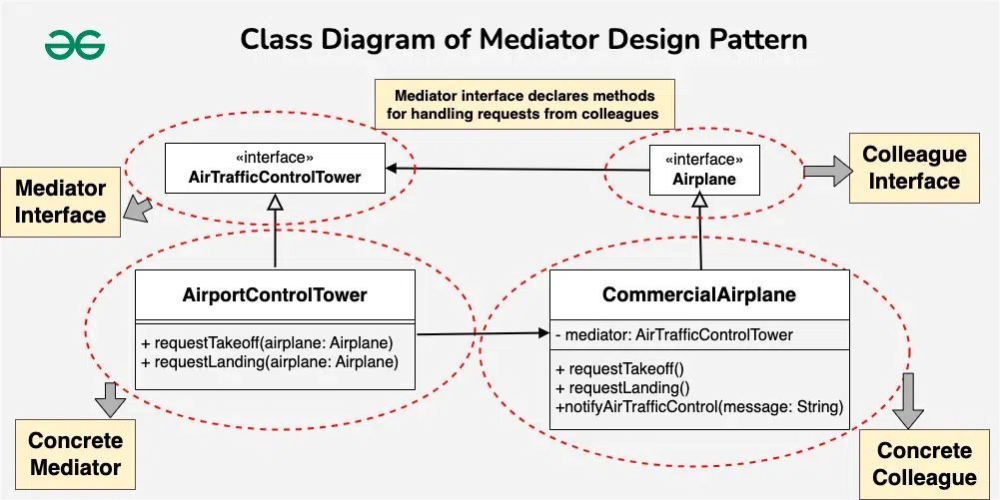

<div id="top"></div>

# Mediator Design Pattern

> Also known as: `Intermediary, Controller`

- ## A behavioral design pattern:
  - `Simplifies` communication between multiple objects in a system by centralizing their interactions through a mediator.
  - Instead of objects interacting directly,
  - they communicate via a mediator,
  - reducing dependencies and making the system easier to manage.

- ## Identification:
  - The pattern restricts direct communications between the objects and forces them to collaborate only via a mediator object.
  - lets you reduce chaotic dependencies between objects.



## Sections

- [Mediator Design Pattern](#mediator-design-pattern)
  - [Sections](#sections)
  - [Definitions](#definitions)
  - [Components \&\& Diagrams (UML class || Sequence diagrams).](#components--diagrams-uml-class--sequence-diagrams)
    - [Components By Guru](#components-by-guru)
      - [Components:](#components)
      - [The Mediator interface](#the-mediator-interface)
      - [Concrete Mediators](#concrete-mediators)
    - [Components By geeksforgeeks](#components-by-geeksforgeeks)
  - [What problems can it solve || When to Use || Use Cases](#what-problems-can-it-solve--when-to-use--use-cases)
    - [GURU](#guru)
  - [Examples](#examples)
    - [Planes Example (Easy) (Good)](#planes-example-easy-good)
      - [Problem Statement:](#problem-statement)
      - [What can be the challenges while implementing this system?](#what-can-be-the-challenges-while-implementing-this-system)
      - [How Mediator Pattern help to solve above challenges?](#how-mediator-pattern-help-to-solve-above-challenges)
    - [Planes Example (Hard) (Good)](#planes-example-hard-good)
    - [Components Example Example (Hard to understand)](#components-example-example-hard-to-understand)
  - [When to use Mediator Design Pattern](#when-to-use-mediator-design-pattern)
    - [Complex Communication:](#complex-communication)
    - [Loose Coupling:](#loose-coupling)
    - [Centralized Control:](#centralized-control)
    - [Changes in Behavior:](#changes-in-behavior)
    - [Enhanced Reusability:](#enhanced-reusability)
  - [When not to use the Mediator Design Pattern?](#when-not-to-use-the-mediator-design-pattern)
    - [Simple Interactions:](#simple-interactions)
    - [Single Responsibility Principle (SRP):](#single-responsibility-principle-srp)
    - [Performance Concerns:](#performance-concerns)
    - [Small Scale Applications:](#small-scale-applications)
    - [Over-Engineering:](#over-engineering)
  - [Summery](#summery)
  - [Sources](#sources)

## Definitions

- <details>
  <summary> <h3 style="display: inline;"> Tutorial Point </h3> </summary>
  - Mediator pattern is used to reduce communication complexity between multiple objects or classes.
  - This pattern provides a mediator class 
    - which normally handles all the communications between different classes 
    - and supports easy maintenance of the code by loose coupling.
  - Mediator pattern falls under behavioral pattern category.

  </details>

- <details>
  <summary> <h3 style="display: inline;"> geeksforgeeks.org </h3> </summary>
  The Mediator pattern:
    - one of the important and widely used behavioral design patterns.
    - Mediator enables the decoupling of objects by introducing a layer in between
    - so that the interaction between objects happens via the layer.
    - Real Life:
      - If the objects interact with each other directly, the system components are tightly coupled with each other making higher maintainability cost and not hard to extend.
      - The mediator pattern focuses on providing a mediator between objects for communication and helps in implementing loose coupling between objects.
  </details>

- <details>
  <summary> <h3 style="display: inline;"> refactoring.guru </h3> </summary>

  `Mediator is a behavioral design pattern`
  - that lets you reduce chaotic dependencies between objects.
  - The pattern restricts direct communications between the objects and forces them to collaborate only via a mediator object.

  </details>

---

## Components && Diagrams (UML class || Sequence diagrams).

### Components By Guru



#### Components:

- Various classes that contain some business logic.
- Each component has a reference to a mediator, declared with the type of the mediator interface.
- The component isn’t aware of the actual class of the mediator, so you can reuse the component in other programs by linking it to a different mediator.

#### The Mediator interface

- declares methods of communication with components, which usually include just a single notification method.
- Components may pass any context as arguments of this method, including their own objects, but only in such a way that no coupling occurs between a receiving component and the sender’s class.

#### Concrete Mediators

- encapsulate relations between various components.
- Concrete mediators often keep references to all components they manage and sometimes even manage their lifecycle.

> Components must not be aware of other components. If something important happens within or to a component, it must only notify the mediator. When the mediator receives the notification, it can easily identify the sender, which might be just enough to decide what component should be triggered in return.

> From a component’s perspective, it all looks like a total black box. The sender doesn’t know who’ll end up handling its request, and the receiver doesn’t know who sent the request in the first place.

### Components By geeksforgeeks



1. Mediator
   - The Mediator interface
     - `defines the communication contract`,
     - specifying methods that concrete mediators should implement to facilitate interactions among colleagues..
     - It encapsulates the logic for coordinating and managing the interactions between these objects,
     - promoting loose coupling and centralizing control over their communication.

1. Colleague
   - Colleague classes are `the components or objects that interact with each other`.
   - `They communicate through the Mediator`, and `each colleague class is only aware of the mediator`, not the other colleagues.
   - This isolation ensures that changes in one colleague do not directly affect others.

1. Concrete Mediator
   - is a specific implementation of the Mediator interface.
   - It coordinates the communication between concrete colleague objects, handling their interactions and ensuring a well-organized collaboration while keeping them decoupled.

1. Concrete colleague
   - Concrete Colleague classes are the specific implementations of the Colleague interface.
   - They rely on the Mediator to communicate with other colleagues, avoiding direct dependencies and promoting a more flexible and maintainable system architecture.

---

## What problems can it solve || When to Use || Use Cases

### GURU

- Use the Mediator pattern
  - when it’s hard to change some of the classes because they are tightly coupled to a bunch of other classes.

- Use the Mediator pattern
  - when you can’t reuse a component in a different program because it’s too dependent on other components.

- Use the Mediator pattern
  - when you find yourself creating tons of component subclasses just to reuse some basic behavior in various contexts.

## Examples

### Planes Example (Easy) (Good)



Source: [link](https://www.geeksforgeeks.org/system-design/mediator-design-pattern/)
Dart Code: [link](examples/planes.dart)

#### Problem Statement:

- Several airplanes in an airport must coordinate their movements and communicate with one another in order to prevent collisions and guarantee safe takeoffs and landings.
- Direct communication between aircraft without a centralized mechanism could result in chaos and higher risk.

#### What can be the challenges while implementing this system?

- Air Traffic Complexity:
  - Direct communication between airplanes might result in complex and error-prone coordination, especially when dealing with multiple aircraft in the same airspace.
- Collision Risks:
  - Without a centralized control mechanism, the risk of collisions between airplanes during takeoffs, landings, or mid-flight maneuvers increases.

#### How Mediator Pattern help to solve above challenges?

- By managing the complex coordination and communication between aircraft and air traffic controllers,
- the mediator pattern contributes to a safer and better-organized aviation system.

- Centralized Control: By serving as a mediator, the air traffic control tower helps aircraft communicate with one another.
- This guarantees that every aircraft is aware of the location and intentions of every other aircraft.
- Collision Avoidance: The mediator (air traffic control tower) manages the flow of airplanes, preventing collisions by providing clear instructions and coordinating their movements.

```dart
/// 1. Colleague Interface(Airplane)
/// Colleague Interface
abstract interface class Airplane {
  void requestTakeoff();
  void requestLanding();
  void notifyAirTrafficControl(String message);
}

/// 2. Concrete Colleague Class(CommercialAirplane)
class CommercialAirplane implements Airplane {
  final AirTrafficControlTower _mediator;

  CommercialAirplane(AirTrafficControlTower mediator) : _mediator = mediator;

  @override
  void requestTakeoff() => _mediator.requestTakeoff(this);

  @override
  void requestLanding() => _mediator.requestLanding(this);

  @override
  void notifyAirTrafficControl(String message) =>
      print("Commercial Airplane: $message");
}

/// 3. Mediator Interface(AirTrafficControlTower)
abstract interface class AirTrafficControlTower {
  void requestTakeoff(Airplane airplane);
  void requestLanding(Airplane airplane);
}

/// 4. Concrete Mediator Class(AirportControlTower)
class AirportControlTower implements AirTrafficControlTower {
  @override
  void requestTakeoff(Airplane airplane) {
    // Logic for coordinating takeoff
    airplane.notifyAirTrafficControl("Requesting takeoff clearance.");
  }

  @override
  void requestLanding(Airplane airplane) {
    // Logic for coordinating landing
    airplane.notifyAirTrafficControl("Requesting landing clearance.");
  }
}

// main
void main(args) {
  // Instantiate the Mediator (Airport Control Tower)
  AirTrafficControlTower controlTower = AirportControlTower();

  // Instantiate Concrete Colleagues (Commercial Airplanes)
  Airplane airplane1 = CommercialAirplane(controlTower);
  Airplane airplane2 = CommercialAirplane(controlTower);

  // Set up the association between Concrete Colleagues and the Mediator
  airplane1.requestTakeoff();
  airplane2.requestLanding();

  // Output:
  // Commercial Airplane: Requesting takeoff clearance.
  // Commercial Airplane: Requesting landing clearance.
}

// Commercial Airplane: Requesting takeoff clearance.
// Commercial Airplane: Requesting landing clearance.

```

### Planes Example (Hard) (Good)

Source: [link](https://refactoring.guru/design-patterns/mediator/java/example)
Dart Code: [link](examples/note_app.dart)

### Components Example Example (Hard to understand)

Source: [link](https://refactoring.guru/design-patterns/mediator/csharp/example)
Dart Code: [link](examples/guru_c_sharp_example.dart)

## When to use Mediator Design Pattern

### Complex Communication:

- Your system involves a set of objects that need to communicate with each other in a complex manner, and you want to avoid direct dependencies between them.

### Loose Coupling:

- You want to promote loose coupling between objects, allowing them to interact without knowing the details of each other's implementations.

### Centralized Control:

- You need a centralized mechanism to coordinate and control the interactions between objects, ensuring a more organized and maintainable system.

### Changes in Behavior:

- You anticipate changes in the behavior of components, and you want to encapsulate these changes within the mediator, preventing widespread modifications.

### Enhanced Reusability:

- You want to reuse individual components in different contexts without altering their internal logic or communication patterns.

## When not to use the Mediator Design Pattern?

### Simple Interactions:

- The interactions between components are straightforward, and introducing a mediator would add unnecessary complexity.

### Single Responsibility Principle (SRP):

- The Single Responsibility Principle states that each component has a single responsibility; adding a mediator could go against this principle and result in less maintainable code.

### Performance Concerns:

- Introducing a mediator could introduce a performance overhead, especially in situations where direct communication between components is more efficient.

### Small Scale Applications:

- In small-scale applications with a limited number of components, the overhead of implementing a mediator might outweigh its benefits.

### Over-Engineering:

- If the Mediator pattern appears like an over-engineered answer for your system's particular requirements, don't use it. Always take into account the particular requirements of your application as well as the trade-offs.

## Summery


- The main idea of the Mediator pattern is to extract the traversal behavior of a collection into a separate object called an `mediator`.

## Sources

- https://www.geeksforgeeks.org/system-design/mediator-design-pattern/
- https://refactoring.guru/design-patterns/mediator
- https://www.tutorialspoint.com/design_pattern/mediator_pattern.htm

<p align="right">(<a href="#top">back to top</a>)</p>
