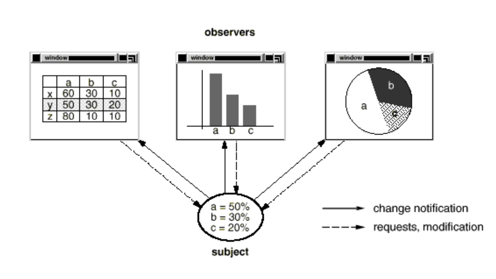
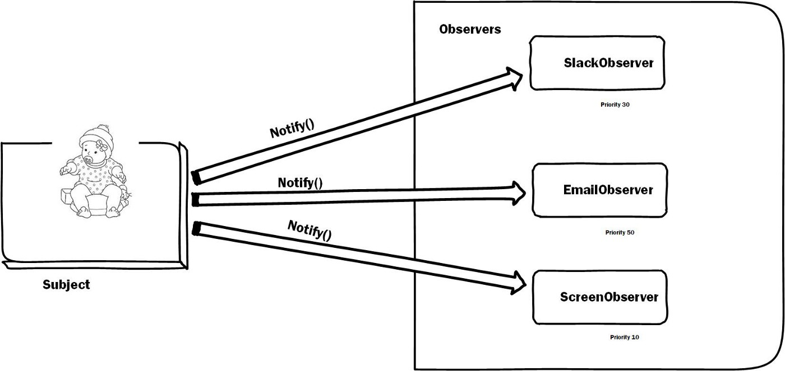
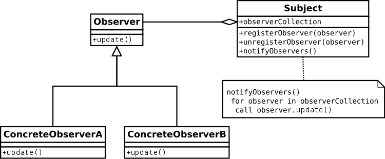

# Observer

also known as `Event-Subscriber`, `Listener`, `Dependents`, `Publish-Subscribe`

> GOF:
>
> - Define a one-to-many dependency between objects
>   - so that when one object changes state,
>   - all its dependents are notified and updated automatically.

- **the subject or Publisher**: The object which is being watched (`stream`).
- **observers or listeners**: The objects which are watching the state changes.(`sinks of events.`)

---

<h3>WikiPedia</h3>

- The prime benefit of the Observer pattern is `that objects can vary independent of each other`.
- In particular,

  - you can add or delete different Observer objects as needed.
  - The Observer objects may be of the same or different classes as long as they implement the same Observer interface.
  - The observer pattern is a software design pattern in
    - which an object, **called the subject**,
    - maintains a list of its dependents, **called observers**,
    - and notifies them automatically of any state changes, usually by **calling one of its methods**.

- The observer pattern is mainly used to implement distributed event handling systems.
- **the subject** is usually named a "stream of events" or "stream source of events"
- **the observers** are called "sinks of events." The stream nomenclature alludes to a physical setup.

---

- The most popular use of Observer pattern is in Model View Controller (MVC) architectural pattern.
- Observer pattern used in Excel, bar chart, and pie chart

- The spreadsheet and the bar chart don't know about each other,
- But they behave as though they do. When the user changes the information in the spreadsheet, the bar chart reflects the changes immediately, and vice versa.

<table>
    <tr>
    <td>
    
    </td>
    </tr>
    <tr>
    <td>
    
    </td>
    </tr>

</table>

  
 <h2 style="display: inline;">  Sections</h2> 

- [Definitions](#Definitions)
- <a href="#when-to-use">When to use</a>
- [What problems can it solve](#What-problems-can-it-solve)
- 
<a href="#Examples">Examples</a>

- 
<a href="#Summery">Summery</a>

- [Sources](#Sources)

## Definitions

    
 <h3 style="display: inline;">refactoring.guru</h3> 

- Observer is a behavioral design pattern.
  - that lets you define a subscription mechanism
  - to notify multiple objects about any events that happen to the object they’re observing.
  

  

      
 <h3 style="display: inline;">  Tutorial Point</h3> 

        
    - behavioral patterns.
    - is used when there is `one-to-many` relationship between objects (Look at Chart)
        - if one object is modified,
        - its depenedent objects are to be notified automatically.
        - Observer pattern uses three actor classes. **Subject, Observer and Client.**
  

    

      
 <h3 style="display: inline;"><a href="#WikiPedia"> Wikipedia</a></h3> 

   

<h2 id="when-to-use" >When to use</h2>

You should consider using this pattern in your application when multiple objects are dependent on the state of one object as it provides a neat and well tested design for the same.

1. The Observer pattern suggests that you add a subscription mechanism to the publisher class so individual objects can subscribe to or unsubscribe from a stream of events coming from that publisher

- In reality, this mechanism consists of
  - 1.  an array field for storing a list of references to subscriber objects
  - 2.  several public methods which allow adding subscribers to and removing them from that list.

1. The object that has some interesting state is often called subject, but since it’s also going to notify other objects about the changes to its state, we’ll call it publisher.
2. All other objects that want to track changes to the publisher’s state are called subscribers.

---

<h2 id="Examples"> Examples</h2>

- <a  href="tutorial_point_example/"> tutorial_point_example</a>

- <a  href="twitter_example/"> twitter_example </a>

- <a  href="basic_example/"> basic_example </a>

<h2 id="Summery"> Summery</h2>

- Here Observer and Subject are interfaces
- notify() method in observer interface defines the action to be taken when the subject provides it data.
- The subject maintains an observer Collection which is simply the list of currently registered(subscribed) observers.
- registerObserver(observer) and unregisterObserver(observer) are methods to add and remove observers respectively.
- notifyObservers() is called when the data is changed and the observers need to be supplied with new data.

<h3 id="Advantages:"> Advantages:</h3>

- Observer pattern provides this **`loose coupling`** as:
  1. Subject only knows that observer implement Observer interface.Nothing more.
  1. There is no need to modify Subject to add or remove observers.
  1. We can reuse subject and observer classes independently of each other.
  1. Open/Closed Principle.
  1. You can introduce new subscriber classes without having to change the publisher’s code (and vice versa if there’s a publisher interface).
  1. You can establish relations between objects at runtime.

<h3 id=" Disadvantages:">  Disadvantages:</h3>

- Memory leaks caused by Lapsed listener problem
  - because of explicit register and unregistering of observers.

<h3 id=" Real-Life-Uses">Real Life Uses:</h3>

- It is heavily used in GUI toolkits and event listener.
- Social media, RSS feeds, email subscription in which you have the option to follow or subscribe and you receive latest notification.
  All users of an app on play store gets notified if there is an update.

## Sources

- https://refactoring.guru/design-patterns/observer
- https://www.geeksforgeeks.org/observer-pattern-set-1-introduction/?ref=lbp
- https://en.wikipedia.org/wiki/Observer_pattern#:~:text=In%20software%20design%20and%20engineering,calling%20one%20of%20their%20methods.

(<a href="#top">back to top</a>)

