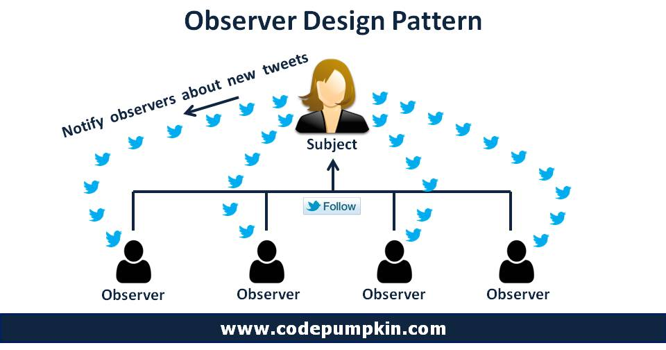
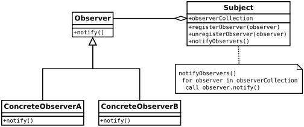

# Twitter Example: Observer Design Pattern

src: https://codepumpkin.com/observer-design-pattern/

<center>


</center>

## Concept

- In this pattern:
- there are many **observers** (objects)
  - which are observing a particular **subject** (object).
  - Observers are basically `interested` and want to be `notified` when there is a change made inside that subject.
- So, they register themselves to that subject.
- When they lose interest in the subject they simply unregister from the subject.
- Sometimes this model is also referred to as the Publisher-Subscriber model.

## Real-Life Example

### Twitter Follow button:

- We can think about a celebrity who has many followers on twitter.
- Each of these followers wants to get all the latest updates of his/her favorite celebrity.
- So, he/she can follow the celebrity as long as his/her interest persists.
- When he loses interest, he simply stops following that celebrity.
- Here we can think of the follower as an observer and the celebrity as a subject.

---

1.  This interface handles adding, deleting and updating all observers

```dart
abstract class Subject {
  void register(Observer o);
  void unregister(Observer o);
  void notifyAllObservers(String s);
}
```

2. The Observers update method is called when the Subject changes

```dart
abstract class Observer {
  void update(String name, String s);
}
```

3. This class extends Subject interface.

```dart
class Celebrity implements Subject {
  final String _celebrityName; //name of the celebrity
  final List<Observer> _followers = []; //list of followers

  Celebrity(this._celebrityName);

  /// add follower to the celebrity's registered follower list
  @override
  void register(Observer o) {
    _followers.add(o);
    print(o.toString() + " has started following " + _celebrityName);
  }

  /// remove follower from celebrity's registered follower list
  @override
  void unregister(Observer o) {
    _followers.remove(o);
    print(o.toString() + " has stopped following " + _celebrityName);
  }

  /// Notify all the registered followers
  @override
  void notifyAllObservers(String tweet) {
    for (Observer follower in _followers) {
      follower.update(_celebrityName, tweet);
    }
    print("All Notified");
  }

  /// This method updates the tweet.
  /// It will internally call notifyAllObservers(tweet) method
  /// after updating the tweet.
  void tweet(String tweet) {
    print("\n" + _celebrityName + " has tweeted :: " + tweet + "\n");

    notifyAllObservers(tweet);
  }
}

```

4. This class extends Observer interface.

```dart
class Follower implements Observer {
  String _followerName;

  Follower(this._followerName);

  /// This method will be called to update all followers regarding the
  /// new tweet posted by celebrity.
  @override
  void update(String celebrityName, String tweet) {
    print(_followerName +
        " has received " +
        celebrityName +
        "'s tweet :: " +
        tweet);
  }

  @override
  String toString() {
    return _followerName;
  }
}

```

```dart
void main() {
  Celebrity amirkhan = new Celebrity("Amirkhan");
  Celebrity selenaGomez = new Celebrity("Selena Gomez");

  Follower amar = new Follower("Amar");
  Follower juhi = new Follower("Juhi");
  Follower urja = new Follower("Urja");
  Follower malay = new Follower("Malay");
  Follower ankit = new Follower("Ankit");
  Follower harsh = new Follower("Harsh");

  amirkhan.register(amar);
  amirkhan.register(juhi);
  amirkhan.register(urja);

  selenaGomez.register(malay);
  selenaGomez.register(ankit);
  selenaGomez.register(harsh);

  amirkhan
      .tweet("Hey guys, came across this interesting trailer, check it out.");
  selenaGomez.tweet("Good Morning..!!");

  amirkhan.unregister(juhi);

  amirkhan.tweet("Teaser of Secret Superstar has been released..!!");
}
```
