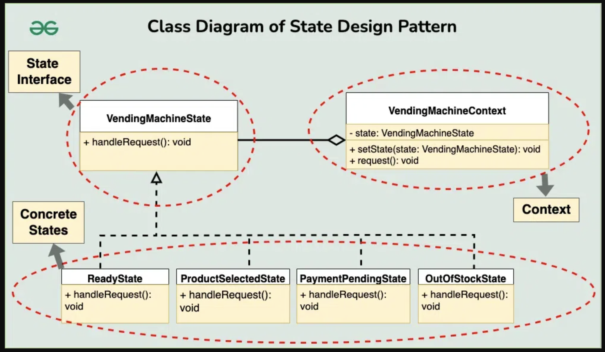
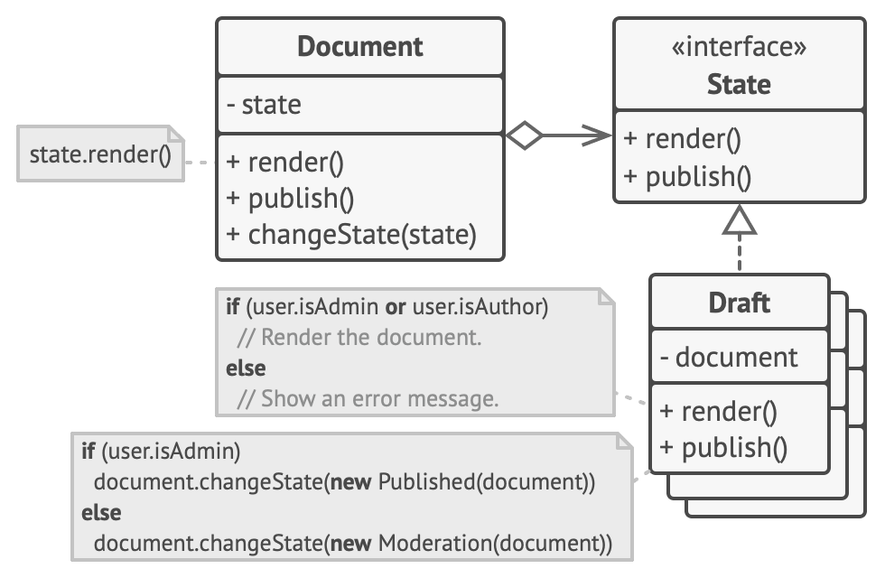

# State Design Pattern
<Behavioral>

<!-- 

  
 <h2 style="display: inline;">  Sections</h2> 

- [State Design Pattern <Behavioral>](#state-design-pattern)
  - [Definitions](#definitions)
  - [Sources](#sources)

 -->

## Definitions  

### Def 1: 
- Behavioral Design Patterns.
- State design pattern is used when an **Object changes its behavior based on its internal state**.

- If we have to change the behavior of an object based on its `state`,
- we can have a state variable in the Object and use the if-else condition block to perform different actions based on the state.
- The state pattern is used to provide a `systematic` and `lose-coupled` way to achieve this through `Context` and `State` implementations.

### geeksforgeeks: https://www.geeksforgeeks.org/state-design-pattern/
- **`allows an object to alter its behavior when its internal state changes.`** == this object is Context
- useful when an object’s behavior depends on its state, 
- and the state can change during the object’s lifecycle.

- This pattern focuses on managing state transitions and coordinating state-specific behaviors.

### tutorialspoint

- Behavior pattern.
- A class behavior changes based on its state.
-  Create:
   -  `objects` which represent various states.
   -  `context` object whose behavior varies as its state object changes.

---

## Components && Diagrams (UML class || Sequence diagrams).

### Context:

- **The Context**
  - The class that contains the object whose behavior changes based on its internal state.
  - It maintains a reference to the current state object that represents the current state of the Context.
  - The Context provides an interface for clients to interact with and typically delegates state-specific behavior to the current state object.

### State Interface or Base Class :
- **Defines a common interface for declaring what each concrete state should do.**
- That mean: This interface typically declares methods that represent the state-specific behavior that the Context can exhibit. 
- It allows the Context to interact with state objects without knowing their concrete types.

### Concrete State:
 - **Provides the implementation for methods defined in State.**
 - Each concrete state class encapsulates the behavior associated with a specific state of the Context. 
 - These classes define how the Context behaves when it is in their respective states.

### Actions:: Are the methods of States

--- 

## What problems can it solve || When to Use || Use Cases

### geeksforgeeks:
#### When to use 
- The State design pattern is beneficial with objects whose behavior changes dynamically based on their internal state:
  - Multiple states: If your object exists in several states (e.g., On/Off, Open/Closed, Started/Stopped), and each state dictates unique behaviors.
  - Complex conditional logic: When conditional statements (if-else or switch-case) become extensive and complex within your object
  - Frequent state changes: If your object transitions between states frequently.
  - Adding new states easily: If you anticipate adding new states in the future.

#### When not to use the State Design Pattern

- Few states with simple behavior.
- Performance-critical scenarios.
- Over-engineering simple problems.

---------

### Refactoring.guru https://refactoring.guru/design-patterns/state

- When you have an object that behaves differently depending on its current state, the number of states is enormous, and the state-specific code changes frequently.

- When you have a class polluted with massive conditionals that alter how the class behaves according to the current values of the class’s fields.

- When you have a lot of duplicate code across similar states and transitions of a condition-based state machine.

----------

## Examples 

### Document Example 
- (Hard and contains all ideas)
- <strong><a href="document_example/" target="_blank">Document Example</a></strong>

### Player Example 
- (above Medium Example)

### Location Example 
- (above Medium Example)

### Action Example 
- (Medium Example)

### Set State 
- (Easy Examples)

### Status Example  
- (Easy Examples)

### Vending Machine 
- (Not Recommended -- near to strategy)

---

## How to implement 

1. Decide what class will act as the context.
   - It could be an existing class which already has the state-dependent code;
   - or a new class, if the state-specific code is distributed across multiple classes.

2. Declare the state interface.
   - Although it may mirror all the methods declared in the context,
   - `aim only for those that may contain state-specific behavior`.

3. For every actual state, 
   1. create a class that derives from the state interface.
   2. Then go over the methods of the context and extract all code related to that state into your newly created class.

--- 
### While moving the code to the state class, you might discover that it depends on private members of the context.
There are several workarounds:
  - Make these fields or methods public.
    - Turn the behavior you’re extracting into a public method in the context 
    - and call it from the state class.
    - This way is ugly but quick, and you can always fix it later.

  - Nest the state classes into the context class, but only if your programming language supports nesting classes.

  - In the context class, add a reference field of the state interface type and a public setter that allows overriding the value of that field.

  - Go over the method of the context again and replace empty state conditionals with calls to corresponding methods of the state object.

   - To switch the state of the context, create an instance of one of the state classes and pass it to the context. You can do this within:
     - the context itself,
     - or in various states,
     - or in the client.
     -  Wherever this is done, the class becomes dependent on the concrete state class that it instantiates.

## Summery

### Strategy && State Patterns
- This structure may look similar to the Strategy pattern,
- but there’s one key difference. 
- In the State pattern, the particular states may be aware of each other and initiate transitions from one state to another,
- whereas strategies almost never know about each other.

### Strategy && State Patterns
- State can be considered as an extension of Strategy.
- Both patterns are based on composition: 
- they change the behavior of the context by delegating some work to helper objects.
- Strategy makes these objects completely independent and unaware of each other.
- However, State doesn’t restrict dependencies between concrete states, letting them alter the state of the context at will.

---

## Sources

1. <https://www.geeksforgeeks.org/state-design-pattern/>
2. https://refactoring.guru/design-patterns/state
3. https://betulkaraman.medium.com/creative-state-management-with-state-design-pattern-e5193b25669d

(<a href="#top">back to top</a>)

