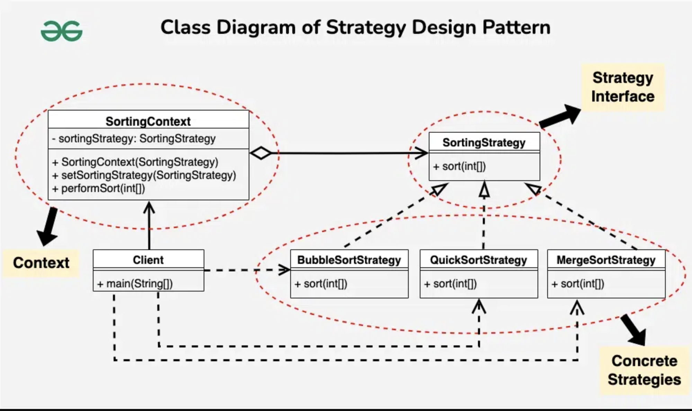

<div id="top"></div>

# Strategy Behavioral Design Pattern

- Strategy is a
  - behavioral design pattern 
  - that lets you define a family of algorithms,
  - put each of them into a separate class,
  - and make their objects interchangeable.


<details>
  <summary> <h2 style="display: inline;">  Sections</h2> </summary>

- [Strategy Behavioral Design Pattern](#strategy-behavioral-design-pattern)
  - [Definitions](#definitions)
  - [Components \&\& Diagrams (UML class || Sequence diagrams).](#components--diagrams-uml-class--sequence-diagrams)
    - [Components By Guru](#components-by-guru)
      - [1. Context:](#1-context)
      - [2. Strategy interface:](#2-strategy-interface)
      - [3. Concrete Strategies:](#3-concrete-strategies)
      - [4. Client:](#4-client)
    - [Components By geeksforgeeks](#components-by-geeksforgeeks)
      - [1. Context](#1-context-1)
      - [2. Strategy Interface](#2-strategy-interface-1)
      - [3. Concrete Strategies](#3-concrete-strategies-1)
      - [4. Client](#4-client-1)
  - [What problems can it solve || When to Use || Use Cases](#what-problems-can-it-solve--when-to-use--use-cases)
    - [The Strategy Design Pattern can be useful in various scenarios, such as:](#the-strategy-design-pattern-can-be-useful-in-various-scenarios-such-as)
  - [Examples](#examples)
    - [Operations with context Example](#operations-with-context-example)
    - [Sorting Example](#sorting-example)
    - [Storage Data Source Example](#storage-data-source-example)
    - [Payment Example](#payment-example)
  - [Summery](#summery)
  - [Sources](#sources)
</details>


## Definitions

- <details>
  <summary> <h3 style="display: inline;">  Tutorial Point</h3> </summary>

  - behavioral patterns.
  - In Strategy pattern -> A class behavior or its algorithm can be changed at run time
  
  </details>

- <details>
  <summary> <h3 style="display: inline;">  geeksforgeeks.org</h3> </summary>

  - allows you to define a family of algorithms or behaviors,
  - put each of them in a separate class,
  - and make them interchangeable at runtime.
  - **This pattern is useful when you want to dynamically change the behavior of a class without modifying its code.**

  </details>


- <details>
  <summary> <h3 style="display: inline;">refactoring.guru</h3> </summary>

  - Strategy is a
  - behavioral design pattern 
  - that lets you define a family of algorithms,
  - put each of them into a separate class,
  - and make their objects interchangeable.

  </details>


## Components && Diagrams (UML class || Sequence diagrams).

### Components By Guru


#### 1. Context:
   - maintains a reference to one of the concrete strategies and
   - communicates with this object only via the strategy interface.

#### 2. Strategy interface:
   - is common to all concrete strategies. 
   - It declares a method the context uses to execute a strategy.

#### 3. Concrete Strategies:
   - implement different variations of an algorithm the context uses.

#### 4. Client: 
   - creates a specific strategy object and passes it to the context.
   - The context exposes a setter which lets clients replace the strategy associated with the context at runtime.

**The context calls the execution method on the linked strategy object each time it needs to run the algorithm. The context doesn’t know what type of strategy it works with or how the algorithm is executed.**

---

### Components By geeksforgeeks

#### 1. Context
- A class or object known as the Context 
  - assigns the task to a strategy object 
  - and contains a reference to it.
- **The Context holds a reference to the selected strategy and delegates the task to it.**

- <details>
  <summary> <p style="display: inline;">More Details</p> </summary>

  - It serves as an intermediary between the client and the strategy,
  - offering an integrated approach for task execution without exposing every detail of the process.
  - The Context maintains a reference to a strategy object and calls its methods to perform the task, allowing for interchangeable strategies to be used.
  
  </details>


#### 2. Strategy Interface
- An abstract class or interface known as the Strategy Interface
  -  specifies a set of methods that all concrete strategies must implement.
- The Strategy Interface serves as a contract that defines a set of methods that all concrete strategies must implement.


- <details>
  <summary> <p style="display: inline;">More Details</p> </summary>

  - As a kind of agreement, it guarantees that all strategies follow the same set of rules and are interchangeable by the Context.
  - The Strategy Interface promotes flexibility and modularity in the design by establishing a common interface that enables decoupling between the Context and the specific strategies.
  </details>


#### 3. Concrete Strategies
- Concrete Strategies are the various implementations of the Strategy Interface.
- Each concrete strategy provides a specific algorithm or behavior for performing the task defined by the Strategy Interface.

- <details>
  <summary> <p style="display: inline;">More Details</p> </summary>

  - Concrete strategies encapsulate the details of their respective algorithms and provide a method for executing the task.
  - They are interchangeable and can be selected and configured by the client based on the requirements of the task.
  </details>


#### 4. Client
- The Client is responsible for 
  - selecting and configuring the appropriate strategy 
  - and providing it to the Context.
- **The Client selects an appropriate strategy based on the task requirements and provides it to the Context**

- <details>
  <summary> <p style="display: inline;">More Details</p> </summary>
    
  - It knows the requirements of the task and decides which strategy to use based on those requirements.
  - The client creates an instance of the desired concrete strategy and passes it to the Context,
  - enabling the Context to use the selected strategy to perform the task.
  </details>


## What problems can it solve || When to Use || Use Cases


### The Strategy Design Pattern can be useful in various scenarios, such as:

- Sorting algorithms:
  - Different sorting algorithms can be encapsulated into separate strategies and passed to an object that needs sorting.
- Validation rules: 
  - Different validation rules can be encapsulated into separate strategies and passed to an object that needs validation.
- Text formatting: 
  - Different formatting strategies can be encapsulated into separate strategies and passed to an object that needs formatting.
- Database access: 
  - Different database access strategies can be encapsulated into separate strategies and passed to an object that needs to access data from different sources.
- Payment strategy: 
  - Different payment methods can be encapsulated into separate strategies and passed to an object that needs to process payments.


 <details>
    <summary> <h3 style="display: inline;">geeksforgeeks</h3> </summary>

- **Multiple Algorithms**: 
  - When you have multiple algorithms that can be used interchangeably based on different contexts, such as sorting algorithms
- **Encapsulating Algorithms**: 
  - When you want to encapsulate the implementation details of algorithms separately from the context that uses them,
- **Runtime Selection**: 
  - When you need to dynamically select and switch between different algorithms at runtime based on user preferences, configuration settings.
- **Reducing Conditional Statements**: 
  - When you have a class with multiple conditional statements that choose between different behaviors.
- **Open and Closed**: 
  - the Strategy pattern makes it easier to extend the system with new algorithms without modifying existing code.

</details>

 <details>
    <summary> <h3 style="display: inline;">refactoring.guru</h3> </summary>

- When you want to use different variants of an algorithm within an object and be able to switch from one algorithm to another during runtime.
- When you have a lot of similar classes that only differ in the way they execute some behavior.
- Use the pattern to isolate the business logic of a class from the implementation details of algorithms that may not be as important in the context of that logic.
- When your class has a massive conditional statement that switches between different variants of the same algorithm.

</details>


## Examples 

### Operations with context Example 
Source: https://www.tutorialspoint.com/design_pattern/strategy_pattern.htm


  - Context is a class which uses a Strategy.
  - In Main will use Context and strategy objects to demonstrate change in Context behavior based on strategy it deploys or uses.


```dart
/// 
/// Step 1: Create an interface.
abstract interface class Strategy {
  int doOperation(int num1, int num2);
}

/// 
/// Step 2: Create concrete classes implementing the same interface.

/// OperationAdd
class OperationAdd implements Strategy {
  @override
  int doOperation(int num1, int num2) => num1 + num2;
}

/// OperationSubtract
class OperationSubtract implements Strategy {
  @override
  int doOperation(int num1, int num2) => num1 - num2;
}

/// OperationMultiply
class OperationMultiply implements Strategy {
  @override
  int doOperation(int num1, int num2) => num1 * num2;
}

///
/// Step 3: Create Context Class.
class Context {
  final Strategy _strategy;

  Context(Strategy strategy) : this._strategy = strategy;

  int executeStrategy(int num1, int num2) {
    return _strategy.doOperation(num1, num2);
  }
}

/// 
/// Step 4: Use the Context to see change in behavior when it changes its Strategy.
void main() {
  Context context = Context(OperationAdd());
  print("10 + 5 = " + "${context.executeStrategy(10, 5)}");

  context = Context(OperationSubtract());
  print("10 - 5 = " + "${context.executeStrategy(10, 5)}");

  context = Context(OperationMultiply());
  pri
}

```
### Sorting Example
 
Source: https://www.geeksforgeeks.org/strategy-pattern-set-1/




```dart
abstract interface class SortStrategy {
  List<int> sort(List<int> list);
}

class BubbleSortStrategy implements SortStrategy {
  @override
  List<int> sort(List<int> list) {
    for (int i = 0; i < list.length; i++) {
      for (int j = 0; j < list.length - i - 1; j++) {
        if (list[j] > list[j + 1]) {
          int temp = list[j];
          list[j] = list[j + 1];
          list[j + 1] = temp;
        }
      }
    }
    return list;
  }
}

class SelectionSortStrategy implements SortStrategy {
  @override
  List<int> sort(List<int> list) {
    for (int i = 0; i < list.length - 1; i++) {
      int minIndex = i;
      for (int j = i + 1; j < list.length; j++) {
        if (list[j] < list[minIndex]) {
          minIndex = j;
        }
      }
      int temp = list[minIndex];
      list[minIndex] = list[i];
      list[i] = temp;
    }
    return list;
  }
}

class SortContext {
  SortStrategy _sortStrategy;

  SortContext(SortStrategy sortStrategy) : _sortStrategy = sortStrategy;

  void changeStrategy(SortStrategy sortStrategy) =>
      _sortStrategy = sortStrategy;

  List<int> sort(List<int> list) {
    return _sortStrategy.sort(list);
  }
}

void main() {
  // Create SortContext with BubbleSortStrategy
  SortContext sortContext = SortContext(BubbleSortStrategy());
  List<int> list1 = [5, 2, 9, 1, 5];
  sortContext.sort(list1);

  // Change strategy to MergeSortStrategy
  sortContext.changeStrategy(SelectionSortStrategy());
  List<int> list2 = [8, 3, 7, 4, 2];
  sortContext.sort(list2);
}

```

### Storage Data Source Example

- <strong><a href="storage_example.dart" target="_blank">Storage Data Source Example</a></strong>


### Payment Example

- /payment_example.dart
- <strong><a href="storage_example.dart" target="_blank">Storage Data Source Example</a></strong>


## Summery

- The Strategy Design Pattern is a powerful pattern in the world of object-oriented programming. 
- It provides a flexible way to encapsulate and swap the behavior of an object at runtime,
- enabling code to be more adaptable and easier to maintain.


## Sources

- https://www.freecodecamp.org/news/a-beginners-guide-to-the-strategy-design-pattern/
- https://www.geeksforgeeks.org/strategy-pattern-set-1/
- https://www.tutorialspoint.com/design_pattern/strategy_pattern.htm
- https://refactoring.guru/design-patterns/strategy 


<p align="right">(<a href="#top">back to top</a>)</p>