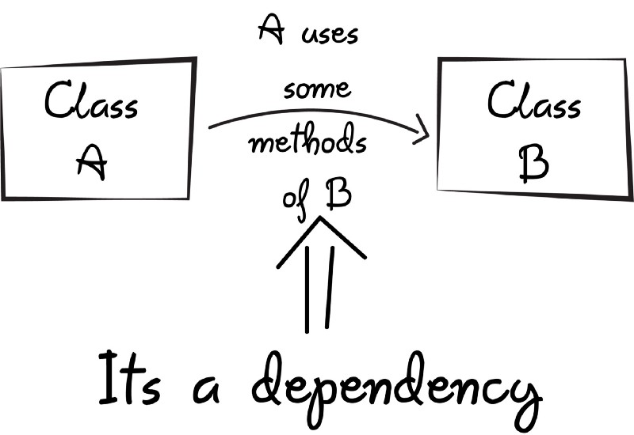
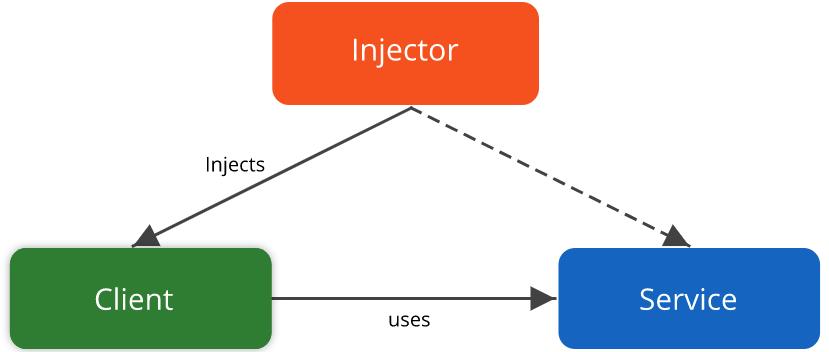

<div id="top"></div>

# Dependency Injection (DI)

Dependency injection is a programming technique that makes a class independent of its dependencies

- by decoupling the usage of an object from its creation.
- It’s derived from the fifth principle of the famous object oriented programming principles S.O.L.I.D designed by Uncle Bob:
  - A class should concentrate on fulfilling its own responsibilities
  - Should not be concerned with creating objects to fulfill those responsibilities.



---

> - it has been used widely in modern programming languages both internally
> - (DI) a best practice to promote `loose coupling`.
> - **GOF**:
>   Dependency injection (DI) is one of the few well-known and accepted design patterns that was not listed in the book by the Gang of Four.
> - 4 Roles Of Dependency injection:
>   - **services**, **clients**, **interfaces** and **injectors**.



- dependency injection is used for keeping code in-line with the dependency inversion principle.

- <a href="#Roles">Roles</a>
- <a href="#types-of-dependency-injection">Types of dependency injection</a>
- [Definitions](#Definitions)
- <a href="#What-problems-can-it-solve">What problems can it solve</a>
- <p><a href="#Examples">Examples</a></p>
- [Sources](#Sources)

---

<h2 id="Roles" >Roles</h2>

### 1. Services and clients

- A **`Service`** is any class which contains useful functionality. In turn
- A **`Client`** is any class which uses services.
- Any object can be a service or a client;
  - the names relate only to the role the objects play in an injection.
  - The same object may even be **`both`**.
    - a client (it uses injected services)
    - and a service (it is injected into other objects).
  - Upon injection, the service is made part of the client's state, available for use

### 2. Interfaces

- Clients should not know how their dependencies are implemented,
- only their names and API.
- A service which retrieves emails,
- for instance, may use the IMAP or POP3 protocols behind the scenes, but this detail is likely irrelevant to calling code that merely wants an email retrieved. By ignoring implementation details,
- clients do not need to change when their dependencies do.

### 3. Injectors

- introduces services to the client.
- The injector, sometimes also called an

  - assembler, container, provider or factory,

- The role of injectors is to construct and connect complex object graphs, where objects may be both clients and services.
- The injector itself may be many objects working together, `but must not be the client`, as this would create a circular dependency.

---

<h2 id="types-of-dependency-injection">Types of dependency injection</h2>

There are three main ways in which a client can receive injected services

- ### Constructor injection
  - where dependencies are provided through a client's class constructor.

```dart
class ClientWithConstructorInjection {
  Service _service;

  // The dependency is injected through a constructor.
  ClientWithConstructorInjection(this._service);
}
```

- ### Setter injection
  - where the client exposes a setter method which accepts the dependency.

```dart
class ClientWithSetterInjection {
  late Service _service;

  // The dependency is injected through a setter method.
  void setService(Service service) {
    _service = service;
  }
}
```

- ### Interface injection
  - where the dependency's interface provides an injector method that will inject the dependency into any client passed to it.

---

## Definitions

Wikipedia

- dependency injection is a design pattern
- in which an object or function receives other objects or functions that it depends on.
- A form of inversion of control,
- dependency injection aims to separate the concerns of constructing objects and using them, leading to loosely coupled programs
- The pattern ensures that an object or function which wants to use a given service should not have to know how to construct those services.
- Instead, the receiving 'client' (object or function) is provided with its dependencies by external code (an 'injector'), which it is not aware of.
- Dependency injection helps by making implicit

---

<h2 id="What-problems-can-it-solve" >What problems can it solve</h2>

dependencies explicit and helps solve the following problems:

- How can a class be independent from the creation of the objects it depends on?
- How can an application, and the objects it uses support different configurations?
- How can the behavior of a piece of code be changed without editing it directly?

<h2 id="Examples"> Examples</h2>

- <a  href="email_example/"> email_example</a>

<h3 id="Advantages:"> Advantages:</h3>

- Assists in unit testing
- Reducing boilerplate code, because dependency initialization- is handled separately by the injector component
- Loose coupling and strong cohesion of code
- Easy to extend/modify applications
<h3 id=" Disadvantages:">  Disadvantages:</h3>

- Creates clients that demand configuration details, which can be onerous when obvious defaults are available.
- Makes code difficult to trace because it separates behavior from construction.
- Is typically implemented with reflection or dynamic programming, hindering IDE automation.
- Typically requires more upfront development effort.
- Encourages dependence on a framework.

## Sources

- https://ona.io/home/dependency-injection-with-kotlin-using-the-koin-library/
- https://en.wikipedia.org/wiki/Dependency_injection#cite_note-5

<p align="right">(<a href="#top">back to top</a>)</p>
