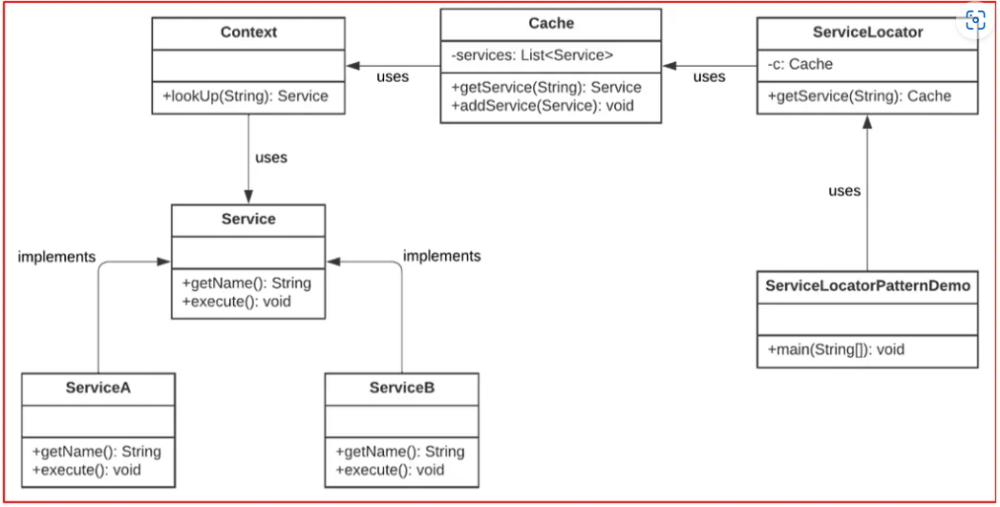

<div id="top"></div>

# Service Locator Pattern

**The purpose of the Service Locator pattern is to return the service instances on demand.** `This is useful for decoupling service consumers from concrete classes.`

## the Service Locator components:

### **Client**

- the client object is a service consumer.
- It’s responsible for invoking the request from the service locator

### **Service Locator**

- is a communication entry point for returning the services from the cache

### **Cache**

- an object for storing service references to reuse them later

### **Initializer**

- creates and registers references to services in the cache

### **Service**

- the Service component represents the original services or their implementation
- The original service object is looked up by the locator and returned on demand.

---



## `https://dotnettutorials.net/lesson/service-locator-design-pattern-in-java/`

```dart

/// An example.

/// First,
/// we’ll create a MessagingService interface for sending messages in different ways:
abstract interface class MessagingService {
  String getMessageBody();
  String getServiceName();
}

/// Next,
/// we’ll define two implementations of the interface above, that send messages through email and SMS:
/// the EmailService class.
class EmailService implements MessagingService {
  String getMessageBody() {
    return "email message";
  }

  String getServiceName() {
    return "EmailService";
  }
}

/// The SMSService class.
class SMSService implements MessagingService {
  String getMessageBody() {
    return "SMS message";
  }

  String getServiceName() {
    return "SMSService";
  }
}

/// After
/// defining the two services,
/// we have to define the logic to initialize them:
class InitialContext {
  Object? lookup(String serviceName) {
    if (serviceName == "EmailService") {
      return EmailService();
    } else if (serviceName == "SMSService") {
      return SMSService();
    }
    return null;
  }
}

/// The last component we need before putting the service locator object together is the cache.
/// In our example, this is a simple class with a List property:
class Cache {
  List<MessagingService> services = [];

  /// retrieve from the list
  MessagingService? getService(String serviceName) {
    for (MessagingService service in services) {
      if (service.getServiceName() == serviceName) {
        print("Returning cached " + serviceName + " object");
        return service;
      }
    }
    return null;
  }

  /// add to the list
  void addService(MessagingService newService) {
    bool exists = false;
    for (MessagingService service in services) {
      if (service.getServiceName() == newService.getServiceName()) {
        exists = true;
      }
    }
    if (!exists) {
      services.add(newService);
    }
  }
}

/// Finally,
/// we can implement our service locator class:

class ServiceLocator {
  static Cache _cache = Cache();
  static InitialContext _context = new InitialContext();

  static MessagingService getService(String serviceName) {
    MessagingService? service = _cache.getService(serviceName);

    if (service != null) {
      return service;
    }

    MessagingService service1 =
        _context.lookup(serviceName) as MessagingService;
    _cache.addService(service1);
    return service1;
  }
}

/// The logic here is fairly simple.
///
/// The class holds an instance of the Cache.
/// Then, in the getService() method, it will first check the cache for an instance of the service.
/// Then, if that’s null, it will call the initializing logic and add the new object to the cache.

void main(List<String> args) {
  MessagingService service = ServiceLocator.getService("EmailService");
  String email = service.getMessageBody();
  print(email);

  MessagingService smsService = ServiceLocator.getService("SMSService");
  String sms = smsService.getMessageBody();
  print(sms);

  MessagingService emailService = ServiceLocator.getService("EmailService");
  String newEmail = emailService.getMessageBody();
  print(newEmail);
}

/// The first time we get the EmailService from the ServiceLocator a new instance is created and returned.
/// Then, after calling it the next time the EmailService will be returned from the cache.

```

<h2 id="Examples"> Examples</h2>

- <a  href="service_locator_example.dart">service_locator_example</a>

<h3 id="Advantages:"> Advantages:</h3>

- Applications can optimize themselves at run-time by selectively adding and removing items from the service locator.

- Large sections of a library or application can be completely separated. The only link between them becomes the registry.
<h3 id=" Disadvantages:">  Disadvantages:</h3>

- The registry makes the code more difficult to maintain (opposed to using Dependency injection), because it becomes unclear when you would be introducing a breaking change.
- The registry hides the class dependencies causing `run-time errors instead of compile-time` errors when dependencies are missing.

## Sources

- https://www.baeldung.com/java-service-locator-pattern
- https://www.geeksforgeeks.org/service-locator-pattern/
- https://dotnettutorials.net/lesson/service-locator-design-pattern-in-java/

<p align="right">(<a href="#top">back to top</a>)</p>
