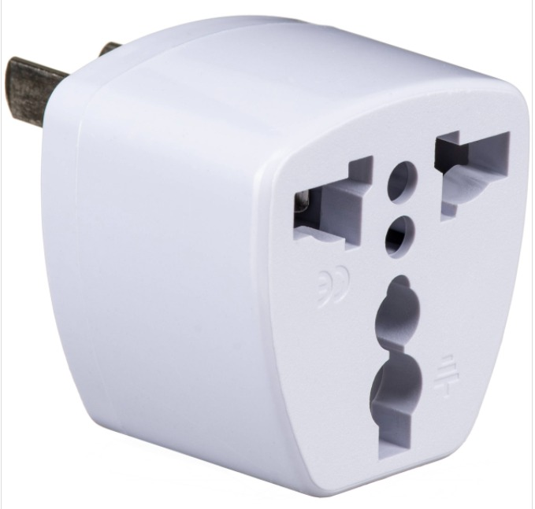
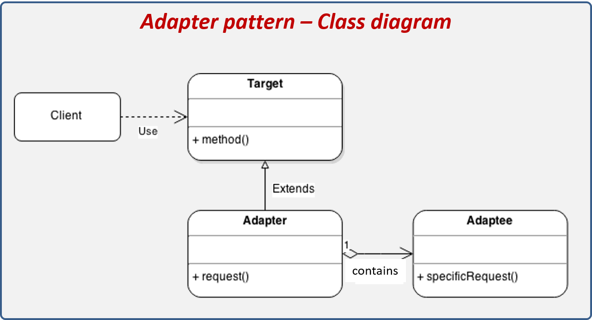
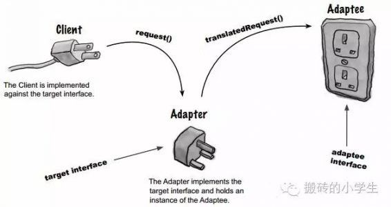

# Adapter Structural Design Pattern
Also known as: `Wrapper`

  - is a Structural Design Pattern.
  - Adapter pattern works as a` bridge between two incompatible interfaces.`
  - A construct which adapts an
  existing interface X to conform to the required interface Y.
 
<table>
  <tr>
    <td></td>
    <td><td>
  </tr>
  <tr>
    <td></td>
    <td><td>
  </tr>
</table>

- An adapter wraps one of the objects to hide the complexity of conversion happening behind the scenes.

      The wrapped object isn’t even aware of the adapter. For example, you can wrap an object that operates in meters and kilometers with an adapter that converts all of the data to imperial units such as feet and miles.
- Sometimes it’s even possible to create a two-way adapter that can convert the calls in both directions.

## Sections

- [Types](#Types)
    - [Object Adapter](#Object-Adapter)
    - [Class Adapter](#Class-Adapter)
- [How to Implement](#How-to-Implement)
- [Examples](#Examples)
    - [square pegs and round holes Example](#square-pegs-and-round-holes-Example)
    - [Xml and json](#Xml-and-json)
    - [vessel volume Example](#vessel-volume-Example)
    - [Example in Arabic with explanation](#Example-in-Arabic-with-explanation)
    - [TO DO](#TO-DO)

## Types

 `Object Adapter && Class Adapter` 

<table>
  <tr>
    <th>Object Adapter</th>
    <th>Class Adapter</th>
  </tr>
  <tr>
    <td>This implementation uses the object composition principle: the adapter implements the interface of one object and wraps the other one. It can be implemented in all popular programming languages.</td>
    <td>This implementation uses inheritance: the adapter inherits interfaces from both objects at the same time. Note that this approach can only be implemented in programming languages that support multiple inheritance, such as C++.</td>
  </tr>
  <tr>
    <td></td>
    <td></td>
  </tr>
   <tr>
    <td>The Adapter is a class that’s able to work with both the client and the service: (1-it implements the client interface), (2-while wrapping the service object).The adapter receives calls from the client via the adapter interface and translates them into calls to the wrapped service object in a format it can understand.</td>
    <td>The Class Adapter doesn’t need to wrap any objects because it inherits behaviors from both the client and the service. The adaptation happens within the overridden methods. The resulting adapter can be used in place of an existing client class.</td>
  </tr>
  
</table>

  ---
## How to Implement
1. Make sure that you have at least two classes with incompatible interfaces:
    1. A useful service class, which you can’t change (often 3rd-party, legacy or with lots of existing dependencies).
    1. One or several client classes that would benefit from using the service class.

1. Declare the client interface and describe how clients communicate with the service.

1. Create the adapter class and make it follow the client interface. Leave all the methods empty for now.

1. Add a field to the adapter class to store a reference to the service object. The common practice is to initialize this field via the constructor, but sometimes it’s more convenient to pass it to the adapter when calling its methods.

1. One by one, implement all methods of the client interface in the adapter class. The adapter should delegate most of the real work to the service object, handling only the interface or data format conversion.

1. Clients should use the adapter via the client interface. This will let you change or extend the adapters without affecting the client code.

    
## Examples

### square pegs and round holes Example
 - Example in dart: <a href="square_pegs_and_round_holes/README.md" target="_blank">square pegs and round holes Example </a>
 - Example Source:  <a href="https://refactoring.guru/design-patterns/adapter" target="_blank">refactoring.guru/design-patterns/adapter</a> 

### Xml and json
 - Example in dart: <a href="xml_and_json/README.md" target="_blank">Xml and json</a>
- Example Source: <a href="https://www.c-sharpcorner.com/article/adapter-design-pattern/" target="_blank">https://www.c-sharpcorner.com/article/adapter-design-pattern/</a> 

### ToyDuck and Bird  
- Example in dart: <a href="bird_and_toy_duck/README.md" target="_blank">bird and toy duck</a>
- Example Source: <a href="https://www.geeksforgeeks.org/adapter-pattern/" target="_blank">https://www.geeksforgeeks.org/adapter-pattern/</a> 

### Example in Arabic with explanation 
-  Source: <a href="https://www.linkedin.com/pulse/design-patterns-arabic-7-adapter-hassan-elseoudy/?originalSubdomain=ae" target="_blank">https://www.linkedin.com/pulse/design-patterns-arabic-7-adapter-hassan-elseoudy/?originalSubdomain=ae</a> 

## TO DO 

- convert sms example to dart
  -    Example: <a href="sms_example/README.md" target="_blank">sms example</a>
  - <a href="https://youtu.be/LP0PZ7WPJPo" target="_blank">https://youtu.be/LP0PZ7WPJPo</a>