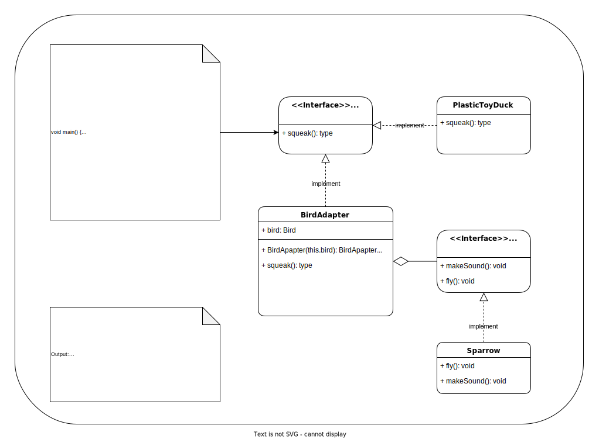

# Example: ToyDuck and Bird 

- Suppose you have a Bird class with fly(), with makeSound()methods.
- And also a ToyDuck class with squeak() method.
- Let’s assume that you are short on ToyDuck objects and you would like to use Bird objects in their place.
- Birds have some similar functionality but implement a different interface, so we can’t use them directly.
- So we will use adapter pattern. Here our client would be ToyDuck and adaptee would be Bird.

  ---
Example Source: <a href="https://www.geeksforgeeks.org/adapter-pattern/" target="_blank">https://www.geeksforgeeks.org/adapter-pattern/</a>  


## This is how our UML would look:




## Dart implementation of Adapter pattern

``` dart
abstract class Bird {
  // birds implement Bird interface that allows
  // them to fly and make sounds adaptee interface
  void fly();
  void makeSound();
}

// a concrete implementation of bird
class Sparrow implements Bird {
  void fly() => print("Flying");
  void makeSound() => print("Chirp Chirp");
}

abstract class ToyDuck {
  // target interface
  // toyducks dont fly they just make
  // squeaking sound
  void squeak();
}

class PlasticToyDuck implements ToyDuck {
  void squeak() => print("Squeak");
}

class BirdAdapter implements ToyDuck {
  // You need to implement the interface your
  // client expects to use.
  Bird bird;

  // we need reference to the object we
  // are adapting
  BirdAdapter(Bird this.bird);

  // translate the methods appropriately
  @override
  void squeak() => bird.makeSound();
}

void main() {
  Sparrow sparrow = Sparrow();
  ToyDuck toyDuck = PlasticToyDuck();

  // Wrap a bird in a birdAdapter so that it
  // behaves like toy duck
  ToyDuck birdAdapter = BirdAdapter(sparrow);

  print("Sparrow...");
  sparrow.fly();
  sparrow.makeSound();

  print("ToyDuck...");
  toyDuck.squeak();

  // toy duck behaving like a bird
  print("BirdAdapter...");
  birdAdapter.squeak();
}
```
## Output
  
     Sparrow...
     Flying
     Chirp Chirp
     ToyDuck...
     Squeak
     BirdAdapter...
     Chirp Chirp


 ## Explanation 
- Suppose we have a `bird` that can makeSound(),
- and we have a `plastic toyDuck` that can squeak().
- Now suppose our client changes the requirement and he wants the toyDuck to makeSound
- than ? Simple solution is that we will just change the implementation class to the adapter class and tell the client to pass the instance of the bird(which wants to squeak()) to that class.

      Before : ToyDuck toyDuck = PlasticToyDuck();
      After : ToyDuck toyDuck = BirdAdapter(sparrow);
You can see that by changing just one line the toyDuck can now do Chirp Chirp !!
