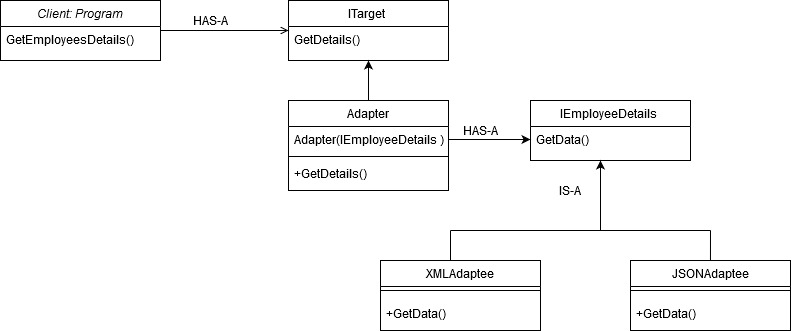

# Example: Let's say our application reads data from an XML file and it serves the purpose for today. Tomorrow, if we would like our application to support JSON, then what?

- Example Source: <a href="https://www.c-sharpcorner.com/article/adapter-design-pattern/" target="_blank">https://www.c-sharpcorner.com/article/adapter-design-pattern/</a>  


## This is how our UML would look:


 
## implementing The Adapter
Let's create an interface ITarget which will be called by our client.

``` dart
// client
abstract class ITarget {
  String GetDetails();
}
```
Now our Adapter,
1. which will implement ITarget:
1. this class also has IEmployeeDetails interface: 

IEmployeeDetails interface will be implemented by both of our `XML & JSON Adaptees` to keep similar architecture in both of the classes, so our client code won't change.
```dart
// adapter
class Adapter implements ITarget {
  IEmployeeDetails Data;
  Adapter(IEmployeeDetails data) : this.Data = data;

  String GetDetails() => Data.GetData();
}
```
Let's create an IEmployeeDetails interface:
```dart
// Service
abstract class IEmployeeDetails {
  String GetData();
}
```

An adaptee class to load xml data. For now, we can generate data from code itself. 
  
```dart
class XMLAdaptee implements IEmployeeDetails {
  String GetData() {
    List<Employee> employees = <Employee>[
      Employee(empCode: 1, empName: "Alex"),
      Employee(empCode: 2, empName: "Martin"),
      Employee(empCode: 3, empName: "Gloria"),
    ];
    // DO Some Stuff
    return employees.toString();
  }
}
```
Now our JSON adaptee:
```dart
class JSONAdaptee implements IEmployeeDetails {
  String GetData() {
    List<Employee> employees = <Employee>[
      Employee(empCode: 1, empName: "Alex"),
      Employee(empCode: 2, empName: "Martin"),
      Employee(empCode: 3, empName: "Gloria")
    ];
    return employees.toString();
  }
}
```

An employee class and an entity class
```dart
class Employee {
  Employee({required this.empCode, required this.empName});
  int empCode;
  String empName;
  @override
  String toString()
   => 'Employee(empCode: $empCode, empName: $empName)';
}
``` 

Last but not least, our caller: class program:

```dart
void main() {
  IEmployeeDetails getXML = XMLAdaptee();
  IEmployeeDetails getJSON = JSONAdaptee();

  //To get XML data
  ITarget employeesDetailsFromXML = Adapter(getXML);
  print(employeesDetailsFromXML.GetDetails());
  
  //To get JSON data
  ITarget employeesDetailsFromJSON = Adapter(getJSON);
  print(employeesDetailsFromJSON.GetDetails());
}
```
Output for XML data or Json data:
         
    [Employee(empCode: 1, empName: Alex),
    Employee(empCode: 2, empName: Martin),
    Employee(empCode: 3, empName: Gloria)]