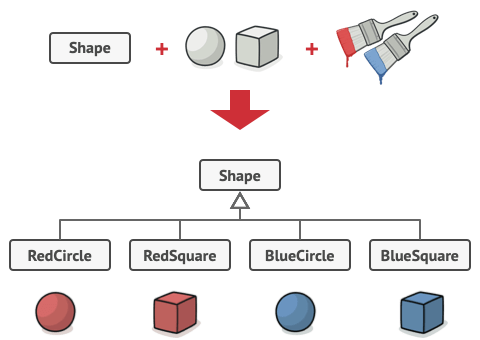
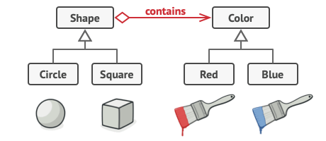

# Colors And Shapes Example 
<a href="https://refactoring.guru/design-patterns/bridge" target="_blank" >https://refactoring.guru/design-patterns/bridge</a>
<a href="https://www.tutorialspoint.com/design_pattern/bridge_pattern.htm" target="_blank" >https://www.tutorialspoint.com/design_pattern/bridge_pattern.htm</a>

- Say you have a geometric Shape class with a pair of subclasses: Circle and Square.
- You want to extend this class hierarchy to incorporate colors, so you plan to create Red and Blue shape subclasses.
- However, since you already have two subclasses, you’ll need to create four class combinations such as `BlueCircle` and `RedSquare`.

## Problem
Number of class combinations grows in geometric 
progression.



    Adding new shape types and colors to the hierarchy will grow it exponentially.
    - For example, to add a triangle shape you’d need to introduce two subclasses, one for each color. And after that, adding a new color would require creating three subclasses, one for each shape type. The further we go, the worse it becomes.

##  Solution

- This problem occurs because we’re trying to extend the shape classes in two independent dimensions: by form and by color. That’s a very common issue with class inheritance.

The Bridge pattern attempts to solve this problem by switching from inheritance to the object composition.



- What this means is that you extract one of the dimensions into a separate class hierarchy, so that the original classes will reference an object of the new hierarchy, instead of having all of its state and behaviors within one class.

- Solution suggested by the Bridge pattern
You can prevent the explosion of a class hierarchy by transforming it into several related hierarchies.

- Following this approach, we can extract the color-related code into its own class with two subclasses:
    - Red and Blue.
    - The Shape class then gets a reference field pointing to one of the color objects.
    - Now the shape can delegate any color-related work to the linked color object.
    - That `reference` will act as a bridge between the Shape and Color classes.
    - From now on, adding new colors won’t require changing the shape hierarchy, and vice versa.

## UML 
- We have a DrawAPI interface(which is acting as a bridge implementer)
- and concrete classes RedCircle, GreenCircle (implementing the DrawAPI interface.)

    ---
- Shape is an abstract class and will use object of DrawAPI.
- main() is The BridgePatternDemo, our main() method (BridgePatternDemo) will use Shape class to draw different colored circle.


## Code Steps 

### Step 1
Create bridge implementer interface.
```dart
abstract class DrawAPI {
  void drawCircle(int radius, int x, int y);
}
```
### Step 2
Create concrete bridge implementer classes implementing the DrawAPI interface.
```dart
class RedCircle implements DrawAPI {
  @override
  void drawCircle(int radius, int x, int y) {
    print(
        "Drawing Circle[ color: red, radius: $radius, Centerpoint: ($x , $y) ]");
  }
}

class GreenCircle implements DrawAPI {
  @override
  void drawCircle(int radius, int x, int y) {
    print(
        "Drawing Circle[ color: green, radius: $radius, Centerpoint: ($x , $y) ]");
  }
}
```
### Step 3
Create an abstract class Shape using the DrawAPI interface.
 ```dart
abstract class Shape {
  DrawAPI drawAPI;
  Shape(DrawAPI drawAPI) : drawAPI = drawAPI;
  void draw();
}
```
### Step 4
Create concrete class implementing the Shape interface.
```dart
class Circle extends Shape {
  int _x, _y, _radius;

  Circle(int x, int y, int radius, DrawAPI drawAPI)
      : _x = x,
        _y = y,
        _radius = radius,
        super(drawAPI);

  void draw() => drawAPI.drawCircle(_radius, _x, _y);
}
```
### Step 5
Use the Shape and DrawAPI classes to draw different colored circles.
```dart
void main() {
  Shape redCircle = Circle(100, 100, 10, RedCircle());
  Shape greenCircle = Circle(100, 100, 10, GreenCircle());

  redCircle.draw();
  greenCircle.draw();
}
```
### Step 6
 output.

// Drawing Circle[ color: red, radius: 10, x: 100, 100]
// Drawing Circle[ color: green, radius: 10, x: 100, 100]
