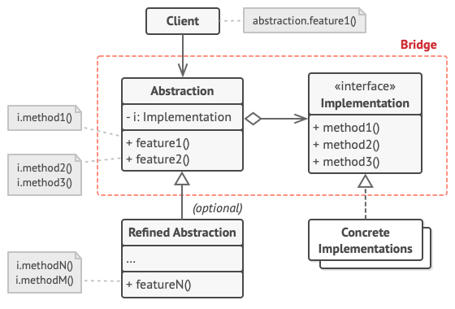

# Grade And Reports Example 
- Arabic Video: <a href="https://youtu.be/N6ogtRbKusw" target="_blank" >https://youtu.be/N6ogtRbKusw</a>

- PHP code: <a href="https://github.com/mohammedabdoh/design_patterns_course/tree/master/src/Patterns/Structural/Bridge" target="_blank" >https://github.com/mohammedabdoh/design_patterns_course/tree/master/src/Patterns/Structural/Bridge</a>

## UML To Implement 

- UML Source: <a href="https://refactoring.guru/design-patterns/bridge" target="_blank" >https://refactoring.guru/design-patterns/bridge</a>


- UML Source: <a href="https://roytuts.com/bridge-design-pattern-in-java/" target="_blank" >https://roytuts.com/bridge-design-pattern-in-java/</a>


## Code  

### Report Interface 
```dart
abstract class Report {
  String showPrimaryGradeReport();
  String showSecondaryGradeReport();
  String showGrade3Report();
}
```
### Report Implementations
```dart
class HTMLReport implements Report {
  String showPrimaryGradeReport() =>
      "<h1>This is a grade Primary report</h1>\n";
  String showSecondaryGradeReport() =>
      "<h1>This is a grade Secondary report</h1>\n";
  String showGrade3Report() => "<h1>This is a grade 3 report</h1>\n";
}

class PlainTextReport implements Report {
  String showPrimaryGradeReport() => "This is a grade Primary report\n";
  String showSecondaryGradeReport() => "This is a grade Secondary report\n";
  String showGrade3Report() => "This is a grade 3 report\n";
}

class XMLReport implements Report {
  String showPrimaryGradeReport() =>
      "<StudentReport>This is a grade Primary report</StudentReport>\n";
  String showSecondaryGradeReport() =>
      "<StudentReport>This is a grade Secondary report</StudentReport>\n";
  String showGrade3Report() =>
      "<StudentReport>This is a grade 3 report</StudentReport>\n";
}
```
### Grade Interface
Create an abstract class Grade
 ```dart
abstract class Grade {
  Report report;
  Grade(this.report);
  String showReport();
}
```
### Grade SubClasses
```dart
class PrimaryGrade extends Grade {
  PrimaryGrade(Report report) : super(report);

  @override
  String showReport() => report.showPrimaryGradeReport();
}

class SecondaryGrade extends Grade {
  SecondaryGrade(Report report) : super(report);

  @override
  String showReport() => report.showSecondaryGradeReport();
}

class Grade3Report extends Grade {
  Grade3Report(Report report) : super(report);

  @override
  String showReport() => report.showGrade3Report();
}
```
### main()
```dart
  // Show any Report Type You Need
  // here I choosed  Html Report
  Report HtmlReport = HTMLReport();

  // Then inject Report type to what grade you want to show
  // here I choosed  Primary
  Grade primaryGrade = PrimaryGrade(HtmlReport);

  print(primaryGrade.showReport());
```
### Output.
    <h1>This is a grade Primary report</h1>


