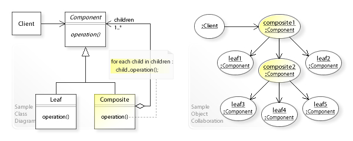
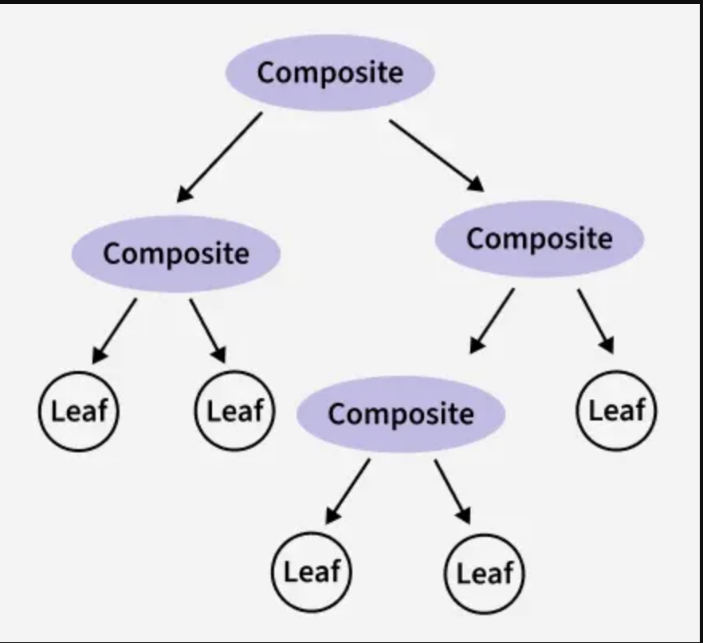
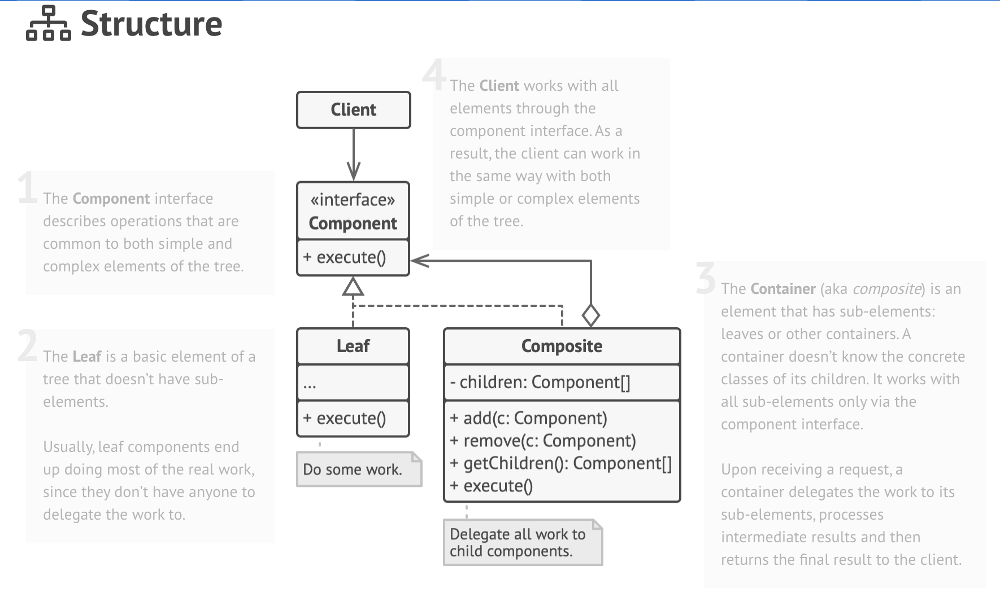
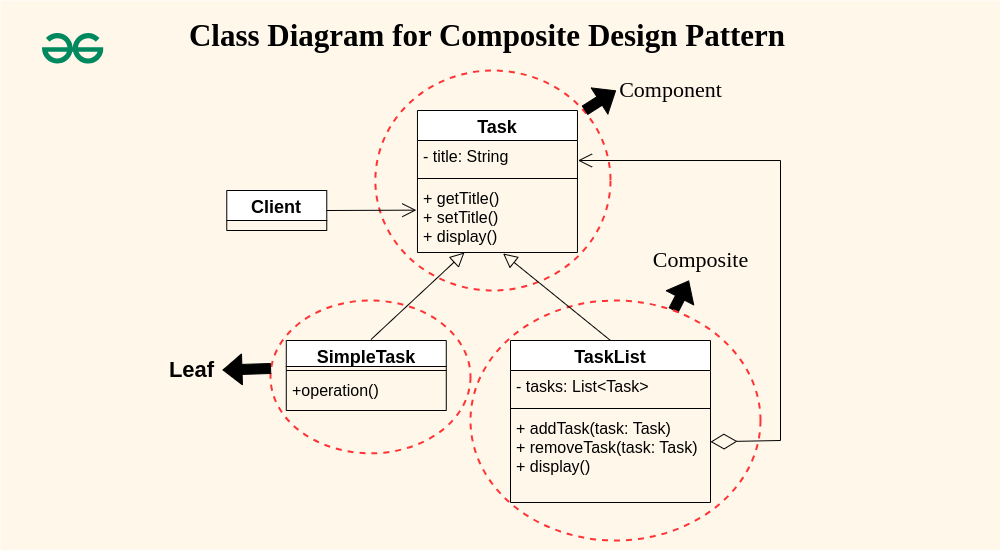
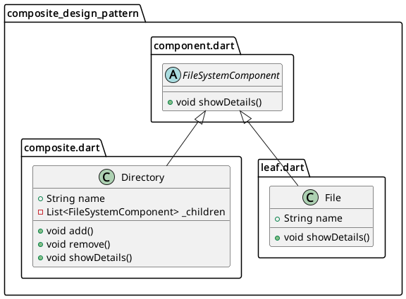

# Composite Design Pattern

> Also known as: `Object Tree`

- ## A Structural design pattern:
  - that lets you compose objects into tree structures
  - and then work with these structures as if they were individual objects.

- ## Identification:
  -

## Sections

- [Composite Design Pattern](#composite-design-pattern)
  - [Sections](#sections)
  - [Definitions](#definitions)
  - [Components \&\& Diagrams (UML class || Sequence diagrams).](#components--diagrams-uml-class--sequence-diagrams)
    - [Components By Guru](#components-by-guru)
      - [Components:](#components)
    - [Components By geeksforgeeks](#components-by-geeksforgeeks)
  - [What problems can it solve || When to Use || Use Cases](#what-problems-can-it-solve--when-to-use--use-cases)
    - [GURU](#guru)
  - [Examples](#examples)
    - [Graphical Shapes Example](#graphical-shapes-example)
    - [Delivery Box Example (Real-Life)](#delivery-box-example-real-life)
    - [File Manager Example (Real-Life)](#file-manager-example-real-life)
    - [HTML Form Builder Example](#html-form-builder-example)
  - [When to use?](#when-to-use)
  - [Summery](#summery)
  - [Sources](#sources)

## Definitions

- 

  
 <h3 style="display: inline;"> Tutorial Point </h3> 

  - Composite pattern is a Structural design pattern.
  - Composite pattern is used where we need to treat a group of objects in similar way as a single object. 
  - Composite pattern composes objects in term of a tree structure to represent part as well as whole hierarchy. 
  - Composite pattern creates a tree structure of group of objects.
  - Composite pattern creates a class that contains group of its own objects. This class provides ways to modify its group of same objects.

  

- 

  
 <h3 style="display: inline;"> geeksforgeeks.org </h3> 

  The Composite pattern:
    - A Structural design pattern.
    - Organizes objects into tree structures, enabling clients to treat individual and composite objects uniformly through a common interface.
    
  

- 

  
 <h3 style="display: inline;"> refactoring.guru </h3> 

  `A Structural design pattern`
  - that lets you compose objects into tree structures
  - and then work with these structures as if they were individual objects.

  

---

## Components && Diagrams (UML class || Sequence diagrams).

### Components By Guru

#### Components:

1. **The Component interface**

- Describes operations that are common to both simple and complex elements of the tree.

2. **The Leaf**

- is basic element of a tree that doesn’t have sub-elements.
- Usually, leaf components end up doing most of the real work,
- since they don’t have anyone to delegate the work to.

3. **The Container** (aka composite)

- is an element that has sub-elements: `leaves` or other containers.
- A container doesn’t know the concrete classes of its children.
- It works with all sub-elements only via the component interface.
- Upon receiving a request, a container delegates the work to its sub-elements, processes intermediate results and then returns the final result to the client.

4. **The Client**

- works with all elements through the component interface.
- As a result, the client can work in the same way with both simple or complex elements of the tree.

### Components By geeksforgeeks

Component
The Composite Pattern consists of key elements that allow treating individual objects and groups uniformly.

1. **Component**:
   - The Component is the common interface for all objects in the composition.
   - It defines the methods that are common to both leaf and composite objects.

1. **Leaf**:
   - The Leaf is the individual object that does not have any children.
   - It implements the component interface and provides the specific functionality for individual objects.

1. **Composite**:
   - The Composite is the container object that can hold Leaf objects as well as the other Composite objects.
   - It implements the Component interface and provides methods for adding, removing and accessing children.

1. **Client**:
   - The Client is responsible for using the Component interface to work with objects in the composition.
   - It treats both Leaf and Composite objects uniformly.

---

## What problems can it solve || When to Use || Use Cases

### GURU

**_Use Composite pattern: when you have to implement a tree-like object structure._**

- Composite pattern provides you with two basic element types that share a common interface: simple leaves and complex containers.
- A container can be composed of both leaves and other containers. This lets you construct a nested recursive object structure that resembles a tree.

**_Use the pattern when you want the client code to treat both simple and complex elements uniformly._**

- All elements defined by the Composite pattern share a common interface.
- Using this interface, the client doesn’t have to worry about the concrete class of the objects it works with.

## Examples

### Graphical Shapes Example

- A classic implementation of simple and compound shapes.
- Dart Code: [link](examples/shapes.dart)

### Delivery Box Example (Real-Life)

- A backend delivery packaging system where boxes contain items or smaller boxes recursively.
- Dart Code: [link](examples/delivery_box_example.dart)

### File Manager Example (Real-Life)

- A hierarchical file system representation where directories contain files or subdirectories, treated uniformly through a common component interface.
- Dart Code: [link](examples/file_manager_example.dart)

### HTML Form Builder Example

- An HTML DOM form builder simulating inputs, fieldsets, and forms nested recursively in a tree structure.
- Dart Code: [link](examples/composite_form_example.dart)

## When to use?

Use the Composite pattern when you have to implement a tree-like object structure.

> The Composite pattern provides you with two basic element types that share a common interface: simple leaves and complex containers. A container can be composed of both leaves and other containers. This lets you construct a nested recursive object structure that resembles a tree.

Use the pattern when you want the client code to treat both simple and complex elements uniformly.

> All elements defined by the Composite pattern share a common interface.
> Using this interface, the client doesn’t have to worry about the concrete class of the objects it works with.

## Summery

## Sources

- https://refactoring.guru/design-patterns/composite
- https://www.geeksforgeeks.org/system-design/composite-method-software-design-pattern/

(<a href="#top">back to top</a>)

