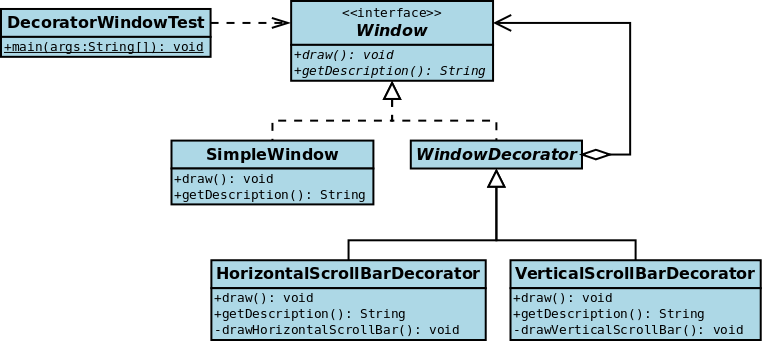

# Decorator Design Pattern
also Known as `wrapper`
 > - structural pattern.
 > - allows a user to add new functionality to an existing object without altering (Changing) its structure.

<table> 
    <tr>
        <td></td>
        <td></td>
    </tr>
</table>

## Sections
- [Definitions](#Definitions)
- [What problems can it solve?](#What-problems-can-it-solve?)
- [What solution does it describe?](#What-solution-does-it-describe?)
- [Examples](#Examples)
    - [Shape Decorator Example](#Shape-Decorator-Example)
    - [Windows Decorator Example](#Windows-Decorator-Example)
    - [Email Notifier Example](#Email-Notifier-Example)
- [TO DO](#TO-DO)
- [Summery](#Summery)


## Definitions

- ### Tutorial Point
    - is a structural Design pattern
    - allows a user to add new functionality to an existing object without altering (Changing) its structure.
    - acts as a wrapper to existing class.

    - > This pattern creates a decorator class which:
        > 1. wraps the original class 
        > 2. provides additional functionality keeping class methods signature intact.


- ### Wikipedia
    - is a design Structural pattern 
    - that `allows behavior to be added to an individual object`, dynamically, without affecting the behavior of other objects from the same class.
    - The decorator pattern is often useful for adhering to the Single Responsibility Principle,    
         - as it allows functionality to be divided between classes with unique areas of concern.
    - Decorator use can be more efficient than subclassing,
        - because an object's behavior can be augmented without defining an entirely new object.


## What problems can it solve?
1. Responsibilities should be added to (and removed from) an object dynamically at run-time.
2. A flexible alternative (Changing) to subclassing for extending functionality should be provided.
    - When using subclassing, different subclasses extend a class in different ways.
    - `But an extension is bound (restricted) to the class at compile-time and can't be changed at run-time.`

## What solution does it describe?
1. implement the interface of the extended (decorated) object (Component) transparently by forwarding all requests to it
perform additional functionality before/after forwarding a request.
2. This allows working with different Decorator objects to extend the functionality of an object dynamically at run-time.

> See also the UML class and sequence diagram below.
<center></center>

## Examples 

### Shape Decorator 
> in this example we will decorate a shape with some color
> without alter (Change) shape class.

- Example in dart: <a href="shape_decorator.dart" target="_blank"> click here </a>
- Example Source: <a href="https://www.tutorialspoint.com/design_pattern/decorator_pattern.htm" target="_blank">https://www.tutorialspoint.com/design_pattern/decorator_pattern.htm</a> 

> -  We're going to create a Shape interface and concrete classes implementing the Shape interface.
> - We will then create an abstract decorator class ShapeDecorator implementing the Shape interface and having Shape object as its instance variable.
> - RedShapeDecorator is concrete class implementing ShapeDecorator.
> - DecoratorPatternDemo, our demo class will use RedShapeDecorator to decorate Shape objects.

- UML 


- code

##### Step 1
- Create an interface.

```dart
abstract class IShape {
  void draw();
}
```
##### Step 2
- Create concrete classes implementing the same interface.

```dart
class Rectangle implements IShape {
  @override
  void draw() => print("Shape: Rectangle");
}

class Circle implements IShape {
  @override
  void draw() => print("Shape: Circle");
}
```
##### Step 3
- Create abstract decorator class implementing the Shape interface.

```dart
abstract class ShapeDecorator implements IShape {
  IShape decoratedShape;
  ShapeDecorator(IShape decoratedShape) : this.decoratedShape = decoratedShape;
  @override
  void draw() => decoratedShape.draw();
}
```
##### Step 4
- Create concrete decorator class extending the ShapeDecorator class.

```dart
class RedShapeDecorator extends ShapeDecorator {
  RedShapeDecorator(IShape decoratedShape) : super(decoratedShape);

  @override
  void draw() {
    decoratedShape.draw();
    _setRedBorder(decoratedShape);
  }

  void _setRedBorder(IShape decoratedShape) {
    print("Border Color: Red");
  }
}
```
##### Step 5
- Use the main() to decorate Shape objects.

```dart
void main(List<String> args) {
  IShape circle = Circle();
  IShape redCircle = RedShapeDecorator(Circle());
  IShape redRectangle = RedShapeDecorator(Rectangle());

  print("Circle with normal border");
  circle.draw();

  print("\nCircle of red border");
  redCircle.draw();

  print("\nRectangle of red border");
  redRectangle.draw();
}
```

### Windows Decorator Example


- Example in dart: <a href="windows_example.dart" target="_blank"> click here </a>
- Example Source: <a href="https://en.wikipedia.org/wiki/Decorator_pattern#Java" target="_blank">https://en.wikipedia.org/wiki/Decorator_pattern#Java</a> 

> - Wikipedia First example (window/scrolling scenario)
> - The following example illustrates the use of decorators
> - using the window/scrolling scenario.


- UML 


- code


##### step 1
- The Window interface class
```dart
abstract class IWindow {
  void draw(); // Draws the Window
  String get getDescription; // returns a description of the Window
}
```
##### step 2
- Implementation of a simple Window without any scrollbars

```dart
class SimpleWindow implements IWindow {
  @override
  void draw() => print("This is SimpleWindow Class Draw"); // Draw window

  @override
  String get getDescription => "simple window Description";
}
```

##### step 3
- The decorator interface class
- abstract decorator class - note that it implements Window

```dart
abstract class WindowDecorator implements IWindow {
  final IWindow _windowToBeDecorated; // the Window being decorated

  WindowDecorator(IWindow windowToBeDecorated)
      : _windowToBeDecorated = windowToBeDecorated;

  @override
  void draw() => _windowToBeDecorated.draw(); //Delegation

  @override
  String get getDescription => _windowToBeDecorated.getDescription; //Delegation
}
```
##### step 4
- The following classes contain the decorators for all Window classes,
##### Step 4.1
- The first concrete decorator which adds vertical scrollbar functionality

```dart
class VerticalScrollBarDecorator extends WindowDecorator {
  VerticalScrollBarDecorator(IWindow windowToBeDecorated)
      : super(windowToBeDecorated);

  @override
  void draw() {
    super.draw();
    _drawVerticalScrollBar();
  }

  @override
  String get getDescription =>
      super.getDescription + ", including vertical scrollbars";

  // new functionality >> Draw the vertical scrollbar
  void _drawVerticalScrollBar() =>
      print("add >> vertical scrollbar functionality");
}
```

##### Step 4.2
- The second concrete decorator which adds horizontal scrollbar functionality

```dart
class HorizontalScrollBarDecorator extends WindowDecorator {
  HorizontalScrollBarDecorator(IWindow windowToBeDecorated)
      : super(windowToBeDecorated);

  @override
  void draw() {
    super.draw();
    _drawHorizontalScrollBar();
  }

  @override
  String get getDescription =>
      super.getDescription + ", including horizontal scrollbars";

  void _drawHorizontalScrollBar() =>
      print("add >> horizontal scrollbar functionality");
}

```
- Here's a test program that creates a Window instance which is fully decorated
- (i.e., with vertical and horizontal scrollbars), and prints its description:
```dart
void main(List<String> args) {
  // Create a decorated Window with horizontal and vertical scrollbars
  IWindow simpleWindowWithoutScrolling = SimpleWindow();
  IWindow decoratedWindow = HorizontalScrollBarDecorator(
      VerticalScrollBarDecorator(simpleWindowWithoutScrolling));

  // Print the Window's description
  print(decoratedWindow.getDescription);
}
```
```dart 
// The output of this program is
// "simple window Description, including vertical scrollbars, including horizontal scrollbars".

// Notice how the getDescription method of the two decorators
// first retrieve the decorated Window's description
// and decorates it with a suffix.
```

### Email Notifier Example
- Example in dart: <a href="email_notifier_example/" target="_blank"> click here </a>


## TO Do
https://refactoring.guru/design-patterns/decorator

## Summery 
- instead of types 
- we use decorators only add functionality 
    - (one implementation)
    - instead of massive inheritance tree
- it is just take the main object (notifer and add a functionality to it)


## Sources

- <a href="https://en.wikipedia.org/wiki/Decorator_pattern" target="_blank"> wikipedia.org - Decorator Design Patterns</a>
- <a href="https://refactoring.guru/design-patterns/decorator" target="_blank"> refactoring.guru - Decorator Design Patterns</a>
- <a href="https://www.tutorialspoint.com/design_pattern/decorator_pattern.htm" target="_blank"> tutorialspoint -  Decorator Design pattern  </a>

