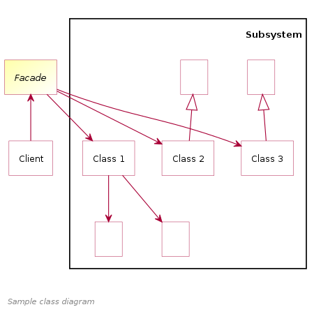
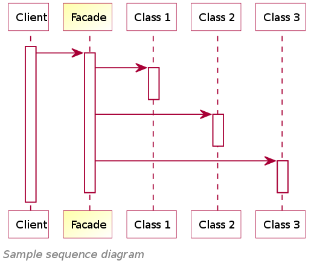
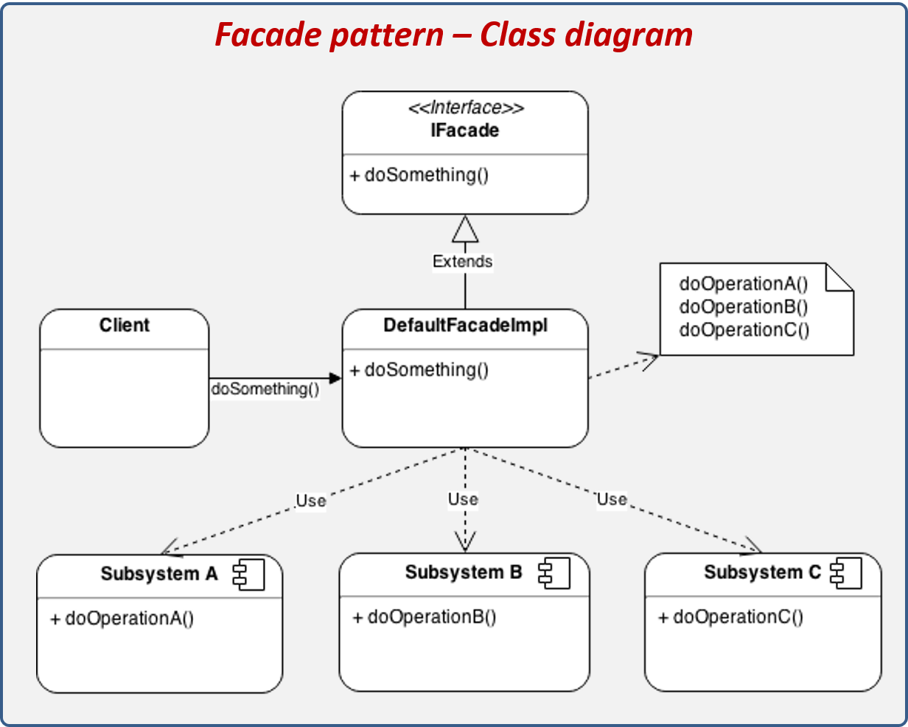

# Facade Structural Design Pattern
> hides the complexities of the system by a class that provide a simple interface to a complex subsystem which contains lots of moving parts.

<table>
  <tr>
    <td></td>
    <td><td>
    <td></td>
  </tr>
</table>

## Sections
- [Definitions](#Definitions)
- [What Problem Facade Solve](#What-Problem-Facade-Solve)
- [Examples](#Examples)
    - [file converter example ](#file-converter-example)
    - [Shape Maker](#Shape-Maker)  Tutorial point Example 
- [Sources](#Sources)

## **Definitions**
<dl>
    <dt><b>tutorialspoint </b></dt>
    <dd> 
        <li>is a structural pattern.</li>
        <li> this pattern adds an interface to existing system to hide its complexities.</li>
        <li> and provides an interface to the client using which the client can access the system.</li>
    </dd>
    <dt><b>Wikipedia </b></dt>
    <dd>
        <li>a structural pattern</li>
        <li>provides a simplified interface to a library, a framework, or any other complex set of classes.</li>
         
        <li>Facade describe how to solve recurring design problems</li>
        <li>to design flexible and reusable object-oriented software, that is, objects that are easier to implement, change, test, and reuse.</li>
    </dd>
</dl> 

 

## **What Problem Facade Solve**

- Imagine that you must make your code work with a broad set of objects that belong to a sophisticated library or framework.
- Ordinarily, you’d need to initialize all of those objects, keep track of dependencies, **`execute methods in the correct order`**, and so on.

> As a result, the business logic of your classes would become tightly coupled to the implementation details of 3rd-party classes, making it hard to comprehend and maintain.

---

### Solution 
- A facade is a `class` that provides a `simple interface` to a complex subsystem which contains lots of moving parts.
- A facade might provide limited functionality in comparison to working with the subsystem directly.
- However, it includes only those features that clients really care about.

- Having a facade is handy when you need to integrate your app with a sophisticated library that has dozens of features, but you just need a tiny bit of its functionality.

## **Examples**

### file converter example 
 - Example in dart: <a href="file_converter/" target="_blank">file converter example </a>

### Shape Maker
- source: <a href="https://www.tutorialspoint.com/design_pattern/facade_pattern.htm" target="_blank">tutorialspoint.com/design_pattern/facade_pattern</a>
- Example in dart: <a href="shape_maker.dart" target="_blank">Shape Maker</a>

## **Sources**

- <a href="https://en.wikipedia.org/wiki/Facade_pattern" target="_blank"> wikipedia.org Facade_pattern</a>
- <a href="https://refactoring.guru/design-patterns/facade" target="_blank"> refactoring.guru design-patterns facade</a>
- <a href="https://www.tutorialspoint.com/design_pattern/facade_pattern.htm" target="_blank"> tutorialspoint -  facade_pattern </a>

