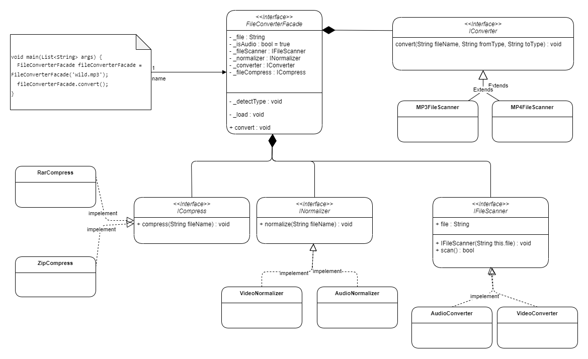

# File Converter Example

## UML 



## Code

### ICompress
```dart
abstract class ICompress {
  void compress(String fileName);
}

class RarCompress implements ICompress {
  @override
  void compress(String fileName) =>
      print("File has been compressed to a rar file\n");
}

```
### IConverter
```dart
abstract class IConverter {
  void convert(String fileName, String fromType, String toType);
}

enum AudioTypes { AUDIO_MP3, AUDIO_AA, AUDIO_AAC }

class AudioConverter implements IConverter {
  void convert(String fileName, String fromType, String toType) => print(
      "I am converting audio file $fileName from $fromType to $toType \n");
}

```
### IFileScanner

```dart

abstract class IFileScanner {
  String file;
  IFileScanner(String this.file);
  bool scan();
}

class MP3FileScanner extends IFileScanner {
  MP3FileScanner(String file) : super(file);

  @override
  bool scan() => math.Random().nextInt(10) > 5;
}

```
### INormalizer

```dart
abstract class INormalizer {
  void normalize(String fileName);
}

class AudioNormalizer implements INormalizer {
  @override
  void normalize(String fileName) => print(
      "I am normalizing the file $fileName due to some data corruption\n");
}

```

### Facade Class
```dart
class FileConverterFacade {
  String _file;
  bool _isAudio = true;

  late IFileScanner _fileScanner;
  late INormalizer _normalizer;
  late IConverter _converter;
  late ICompress _fileCompress;

  FileConverterFacade(String filePath) : _file = filePath {
    _detectType();
    _load();
  }

  void _detectType() {
    String fileExtension = _file.split('.').last;
    if (["mp3", "aa", "aac"].contains(fileExtension)) {
      _fileScanner = MP3FileScanner(_file);
      _normalizer = AudioNormalizer();
      _converter = AudioConverter();
      _fileCompress = ZipCompress();
    } else {
      _fileScanner = MP4FileScanner(_file);
      _normalizer = VideoNormalizer();
      _converter = VideoConverter();
      _fileCompress = RarCompress();
      _isAudio = false;
    }
  }

  void _load() {
    if (_fileScanner.scan()) {
      _normalizer.normalize(_file);
    } else {
      // let this be an CorruptedFileException ;
      // but for now we will print just error
      print("error from file Scan");
    }
  }

  convert() {
    if (_isAudio) {
      _converter.convert(
          _file, AudioTypes.AUDIO_MP3.name, AudioTypes.AUDIO_AAC.name);
    } else {
      _converter.convert(
          _file, VideoTypes.AUDIO_MP4.name, VideoTypes.AUDIO_AVI.name);
    }
    _fileCompress.compress(_file);
  }
}

```

### Main Method
```dart
void main(List<String> args) {
  FileConverterFacade fileConverterFacade = FileConverterFacade('wild.mp3');
  fileConverterFacade.convert();
}
```