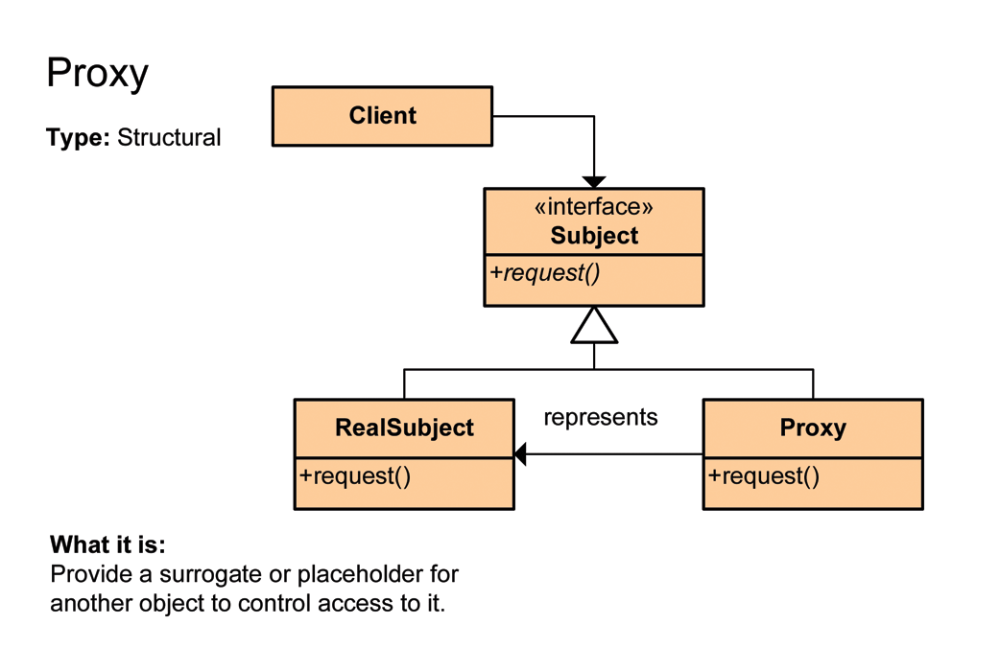
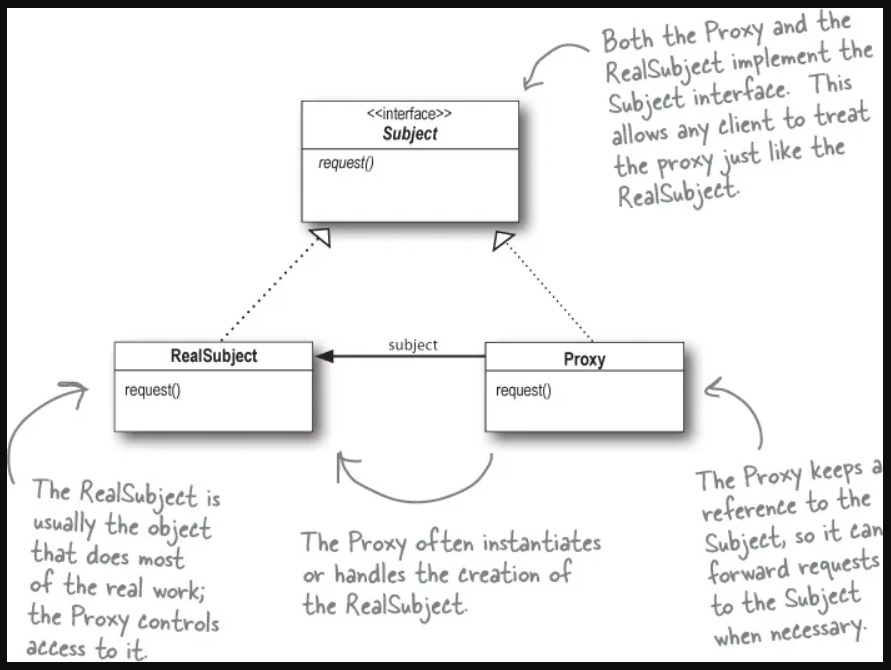

<div id="top"></div>

# Proxy Design Pattern
also Known as `Surrogate`
 > GOF: 
 > - structural pattern.
 > - Provide a surrogate (replacement) or placeholder for another object to control access to it.
 >> - A proxy controls access to the original object,
 >> - allowing you to perform something either before or after the request gets through to the original object.

image source: https://refactoring.guru/design-patterns/proxy#:~:text=Proxy%20is%20a%20structural%20design,through%20to%20the%20original%20object.

<p align="center"> 
    
</p>
<p align="center"> 
    
</p>

<details>
  <summary> <h2 style="display: inline;">  Sections</h2> </summary>

- [Definitions](#Definitions)
- [What problems can it solve](#What-problems-can-it-solve)
- [What solution does it describe](#What-solution-does-it-describe)
- [Applicability](#Applicability)
- [Examples](#Examples)
    - [Image Example](#Image-Example)
    - [3rd party youtube example](#3rd-party-youtube-example)
    - [Router Example](#Router-Example)
- [Sources](#Sources)
</details>


## Definitions

- <details>
  <summary> <h3 style="display: inline;">  Tutorial Point</h3> </summary>
  - a class represents functionality of another class.
  </details>
   


- <details>
  <summary> <h3 style="display: inline;">  Wikipedia</h3> </summary>
  
    -  A proxy: in its most general form, is a ***class functioning as an interface to something else***.
    - The proxy could interface to anything: 
      - a `network connection`, a `large object in memory`, a `file`, or `some other resource`
      - that is expensive or impossible to duplicate.
    > - In short, a proxy is a wrapper or agent object that is being called by the client
    >-  to access the real serving object behind the scenes. 
    >- Use of the proxy can simply be forwarding to the real object, or can provide additional logic.
    >- In the proxy, extra functionality can be provided,
    >---
    > - for example ---
    > - caching when operations on the real object are resource intensive,
    > - or checking preconditions before operations on the real object are invoked.
    > - For the client, usage of a proxy object is similar to using the real object, because both implement the same interface.
    </details>
    


## What problems can it solve

1. The access to an object should be controlled.
2. Additional functionality should be provided when accessing an object.
    - >When accessing sensitive objects, for example, it should be possible to check that clients have the needed access rights.


## What solution does it describe
<!-- wikipedia -->
-  <details>
    <summary> <h3 style="display: inline;">wikipedia</h3> </summary>

    >- `wikipedia`: This makes it possible to work through a Proxy object to perform additional functionality when accessing a subject. For example, to check the access rights of clients accessing a sensitive object.
    </details>

<!-- GOF Motivation -->
- <details>
  <summary> <h3 style="display: inline;">GOF Motivation</h3> </summary>

    - `Gof`: One reason for controlling access to an object is to defer (delay) the full cost of its creation and initialization until we actually need to use it.
    - **Example** Consider a document editor that can embed graphical objects in a document. 
        - Some graphical objects, like large raster images, can be expensive to create.
        - But opening a document should be fast,
        - so we should avoid creating all the expensive objects at once when the document is opened. 
        
        > This isn't necessary anyway, because not all of these objects will be visible in the document at the same time. 
    --- 
    - Full Example in dart: <a href="image_example/" target="_blank"> click here </a>
    - Example Source GOF : <a href="https://books.google.com.eg/books/about/Design_Patterns.html?id=6oHuKQe3TjQC&printsec=frontcover&source=kp_read_button&hl=en&redir_esc=y#v=onepage&q&f=false" target="_blank">Design Patterns: Elements of Reusable Object-Oriented Software</a> 
  </details>

## Applicability 
Proxy is applicable whenever there is a need for a more versatile or sophisticated reference to an object than a simple pointer. Here are several common situations in which the Proxy pattern is applicable: 
### 1. remote proxy:
  - provides a local representative for an object in a different address space.

### 2. virtual proxy:
- creates expensive objects on demand.
- The ImageProxy described in the Motivation is an example of such a proxy.

### 3. protection proxy:
- controls access to the original object.
- Protection proxies are useful when objects should have different access rights.

### 4. smart reference:
> also called `smart pointers`
- is a replacement for a bare pointer that performs additional actions when an object is accessed. 
- Typical uses include
  1.  counting the number of references to the real object so that it can be freed automatically when there are no more references.
  1.  loading a persistent object into memory when it's first referenced.
  1.  checking that the real object is locked before it's accessed to ensure that no other object can change it. 

### the UML class and sequence diagram below.

<p align="center" ></p>

> - To act as substitute for a subject, a proxy must implement the Subject interface.
> -  Clients can't tell whether they work with a subject or its proxy.

## Examples 

### Image Example 
- Example in dart: <a href="image_example/" target="_blank"> click here </a>
- Example Source: GOF && https://www.tutorialspoint.com/design_pattern/proxy_pattern.htm 

#### code
```dart
abstract class Graphic {
  void displayImage();
}

// On System A
class RealImage implements Graphic {
  final String _filename;

  RealImage(this._filename) {
    _loadImageFromDisk();
  }

  /// Loads the image from the disk
  void _loadImageFromDisk() => print("Loading   $_filename");

  /// Displays the image
  void displayImage() => print("Displaying $_filename");
}

// On System B
class ProxyImage implements Graphic {
  final String _filename;
  RealImage? _image;

  ProxyImage(this._filename);

  /// Displays the image
  void displayImage() {
    if (_image == null) {
      _image = RealImage(_filename);
    } else {
      _image!.displayImage();
    }
  }
}

// Test method
void main(List<String> arguments) {
  Graphic image1 = ProxyImage("HiRes_10MB_Photo1");
  Graphic image2 = ProxyImage("HiRes_10MB_Photo2");

  print("--- image1----");
  image1.displayImage(); // loading necessary
  image1.displayImage(); // loading unnecessary
  print("--- image2----");
  image2.displayImage(); // loading necessary
  image2.displayImage(); // loading unnecessary
  print("--- image1----");
  print("image1.displayImage() again  = will display without loading ");
  image1.displayImage(); // loading unnecessary
}

// Output

// --- image1----
// Loading   HiRes_10MB_Photo1
// Displaying HiRes_10MB_Photo1
// --- image2----
// Loading   HiRes_10MB_Photo2
// Displaying HiRes_10MB_Photo2
// --- image1----
// image1.displayImage() again  = will display without loading 
// Displaying HiRes_10MB_Photo1
```

### 3rd party youtube example 
- Example in dart: <a href="3rd_party_youtube_example/" target="_blank"> click here </a>
- Example Source: https://refactoring.guru/design-patterns/proxy/java/example 

### Router example 
- Example in dart: <a href="router_example/" target="_blank"> click here </a>
- this example to show the protection proxy


<table>
  <tr>
    <td></td>
    <td><td>
  </tr>
</table>

## Summery
- A proxy, in its most general form, is a class functioning as an interface to something else.
- The proxy could interface to anything: a network connection, a large object in memory, a file, or some other resource that is expensive or impossible to duplicate.
- In short, a proxy is a wrapper or agent object that is being called by the client to access the real serving object behind the scenes.
## Sources

- https://refactoring.guru/design-patterns/proxy#:~:text=Proxy%20is%20a%20structural%20design,through%20to%20the%20original%20object.

- GOF Book
- https://www.tutorialspoint.com/design_pattern/proxy_pattern.htm
- https://en.wikipedia.org/wiki/Proxy_pattern

<p align="right">(<a href="#top">back to top</a>)</p>