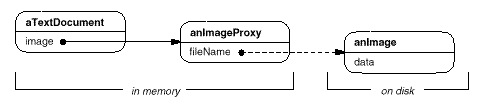
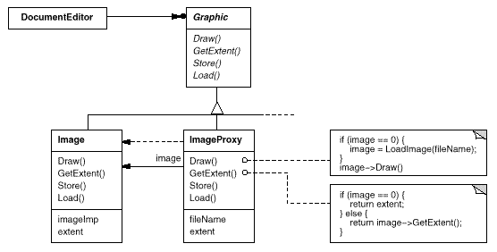

# Image Example From GOF

Consider a document editor that can embed graphical objects in a document. 

- Some graphical objects, like large raster images, can be expensive to create.
- But opening a document should be fast,
- so we should avoid creating all the expensive objects at once when the document is opened. 
        
    > This isn't necessary anyway, because not all of these objects will be visible in the document at the same time.
    ---
 These constraints would suggest creating each expensive object on demand, which in this case occurs when an image becomes visible.
  1.  But what do we put in the document in place of the image?
  2. And how can we hide the fact that the image is created on demand so that we don't complicate the editor's implementation? This optimization shouldn't impact the rendering and formatting code,
      
      > - The solution is to use another object,
      > - an image proxy, that acts as a stand-in for the real image.
      > - The proxy acts just like the image and takes care of instantiating it when it's required.

<div align="center">

</div>

`The imageProxy`: 
- creates the real image only when the document editor asks it to display itself by invoking its Draw operation.
- The proxy forwards subsequent requests directly to the image. It must therefore keep a reference to the image after creating it. 

    ---

Let's assume that images are stored in separate files. 
- In this case we can use the file name as the reference to the real object.
- The proxy also stores 
    1. its extent (png, jpg, gif),
    2. its width and height.
    > The extent lets the proxy respond to requests for its size from the formatter without actually instantiating the image. 

The following class diagram illustrates this example in more detail. 
<div align="center">

</div>

- `documentEditor`:
 accesses embedded images through the interface defined by the abstract Graphic class.
- `ImageProxy` 
    1. is a class for images that are created on demand.
    2. maintains the file name as a reference to the image on disk. The file name is passed as an argument to the ImageProxy constructor. 
    3. also stores the bounding box of the image and a reference to the real Image instance.
        -  This reference won't be valid until the proxy instantiates the real image.
        - The Draw operation makes sure the image is instantiated before forwarding it the request.
        - GetExtent forwards the request to the image only if it's instantiated; otherwise ImageProxy returns the extent it stores.

example Structure:


<table align="center"> 
    <tr>
        <th>class</th>
        <th>What it do </th>
    </tr>
    <tr>
        <td>Proxy (ImageProxy)</td>
        <td>

1. maintains a reference that lets the proxy access the real subject. 
    - Proxy may refer to a Subject if the RealSubject and Subject interfaces are the same. 

1. provides an interface identical to Subject's so that a proxy can by substituted for the real subject.
1. controls access to the real subject and may be responsible for creating and deleting it.
1. other responsibilities depend on the kind of proxy:
    - remote proxies are responsible for encoding a request and its arguments and for sending the encoded request to the real subject in a different address space.
    - virtual proxies may cache additional information about the real subject so that they can postpone accessing it. For example, the ImageProxy from the Motivation caches the real image's extent.
    - protection proxies check that the caller has the access permissions required to perform a request. 
        </td>
    </tr>
    <tr>
    <td>Subject (Graphic)</td>
    <td>  defines the common interface for RealSubject and Proxy so that a Proxy can be used anywhere a RealSubject is expected.</td>
    </tr>
    <tr>
    <td>RealSubject (Image) </td>
    <td> defines the real object that the proxy represents. </td>
    </tr>
</table>


## code

```dart

abstract class Graphic {
  void displayImage();
}

// On System A
class RealImage implements Graphic {
  final String _filename;

  RealImage(this._filename) {
    _loadImageFromDisk();
  }

  /// Loads the image from the disk
  void _loadImageFromDisk() => print("Loading   " + _filename);

  /// Displays the image
  void displayImage() => print("Displaying " + _filename);
}

// On System B
class ProxyImage implements Graphic {
  final String _filename;
  RealImage? _image;

  ProxyImage(this._filename);

  /// Displays the image
  void displayImage() {
    if (_image == null) {
      _image = RealImage(_filename);
    } else {
      _image!.displayImage();
    }
  }
}

```
### Testing 
```dart

void main(List<String> arguments) {
  Graphic image1 = ProxyImage("HiRes_10MB_Photo1");
  Graphic image2 = ProxyImage("HiRes_10MB_Photo2");

  print("--- image1----");
  image1.displayImage(); // loading necessary
  image1.displayImage(); // loading unnecessary
  print("--- image2----");
  image2.displayImage(); // loading necessary
  image2.displayImage(); // loading unnecessary
  print("--- image1----");
  print("image1.displayImage() again  = will display without loading ");
  image1.displayImage(); // loading unnecessary
}

// Output

// --- image1----
// Loading   HiRes_10MB_Photo1
// Displaying HiRes_10MB_Photo1
// --- image2----
// Loading   HiRes_10MB_Photo2
// Displaying HiRes_10MB_Photo2
// --- image1----
// image1.displayImage() again  = will display without loading 
// Displaying HiRes_10MB_Photo1


```